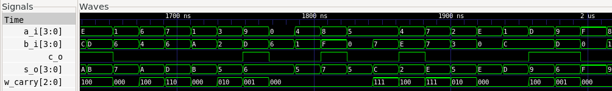

# Tutorial: Verifying a 4-bit Adder using UVM.

This tutorial is a practical guide focused on verifying a Verilog *4-bit adder* module. It assumes you have already read the main `README.md` and understand the verification architecture (Driver, Monitor, Scoreboard) we are using.

Our goal here is to detail:
1.  The Verilog module we are testing (DUT).
2.  The specific verification logic for the *4-bit adder*.
3.  How to run the simulation and interpret the results.

## Prerequisites

To follow this tutorial, you will need:
* A Verilog simulator (e.g., Icarus Verilog).
* Python 3.6+.
* Cocotb (`pip install cocotb`).
* GTKWave (optional, for waveform viewing).

## File Structure

We assume the following file structure for the project:
```bash
/project-adder-4bits
│
├── adder_4bits.v       # Design Under Test 
├── uvm_adder_4bits.py  # UVM testbench 
├── Makefile            
└── dump.fst            # (Generated after simulation) Waveform file
```

## 1. The DUT (Design Under Test): `adder_4bits.v`

The *4-bit adder* is a combinational circuit that adds two 4-bit input values (`a` and `b`) and produces a 4-bit sum (`sum`) and a carry-out (`carry`). 

Our goal is to prove that our [4-bit adder](https://github.com/UVMUFSC/IP-Cores/tree/main/ip-cores/adder-4bits) verilog implementation is correct. 

# 2. The Verification Logic: `uvm_adder_4bits.py`

Although our testbench has several components (Driver, Monitor), the "intelligence" of the 4-bit adder verification is concentrated in two places:

---

## a) The Reference Model (Scoreboard)

The **Scoreboard** needs to know what the correct result is for any given input.  
We do this by implementing the same arithmetic logic as the 4-bit adder, but in **Python**.  
This is our *golden model*.

Look at the `ref_model` function inside the `Scoreboard` class:

```python
# 4. Scoreboard
class Scoreboard:
    # ... (other functions) ...
    def ref_model(self, tr: Adder4BitsTransaction):
        # This is the 'golden model' logic in Python
        total = tr.a + tr.b
        sum_expected = total & 0xF  # 4-bit result
        carry_expected = (total >> 4) & 1  # Carry bit
        
        # Store the expected result for future comparison
        self.expected_queue.append({
            "inputs": (tr.a, tr.b),
            "outputs": (sum_expected, carry_expected)
        })
```
## b) The Test Sequence (Test)
Since the 4-bit adder has 8 input bits (4 for each operand), we use directed corner cases and random testing to achieve good coverage.

This is defined in the adder_4bits_random_test function:

```python
# 6. Test
@cocotb.test()
async def adder_4bits_random_test(dut):
    env = Environment(dut)

    # 1. We define corner case test vectors
    corner_cases = [(0, 0), (15, 0), (8, 7), (8, 8), (15, 15)]

    # 2. We iterate through each corner case
    for a, b in corner_cases:
        tr = Adder4BitsTransaction(a=a, b=b)
        
        # 3. Tell the Scoreboard what to expect
        env.scoreboard.ref_model(tr)
        
        # 4. Send the inputs to the DUT
        await env.driver.drive(tr)
        
        # 5. Capture the DUT outputs (and trigger the Scoreboard)
        await env.monitor.run()

    # 6. Random testing for additional coverage
    for _ in range(50):
        a = random.randint(0, 15)
        b = random.randint(0, 15)
        tr = Adder4BitsTransaction(a=a, b=b)
        
        env.scoreboard.ref_model(tr)
        await env.driver.drive(tr)
        await env.monitor.run()

    # 7. Check if any errors were found
    assert env.scoreboard.errors == 0
```


The test combines directed testing with random testing to achieve comprehensive coverage.

# 3. Running the Verification

To run the simulation, we need a Makefile that tells Cocotb which files to use.

##  Makefile

```makefile
SIM ?= icarus
TOPLEVEL_LANG ?= verilog

VERILOG_SOURCES += adder_4bits.v

COCOTB_TEST_MODULES = uvm_adder_4bits

TOPLEVEL = adder_4bits

include $(shell cocotb-config --makefiles)/Makefile.sim
```

With this file in the folder, just run in the terminal:
```bash
make SIM=icarus WAVES=1
```

This will compile the Verilog, start the simulator, and run the Python testbench. 
```bash
WAVES=1
```
It will be responsible for generating the waveform files in `.fst` format.

# 4. Analyzing the Results

After running `make`, we analyze two artifacts:

## a) Console Output
The console shows the Scoreboard log in real-time. Each [SCOREBOARD PASS] line tells us that, for a given pair of inputs, the DUT's sum and carry outputs matched our reference model's outputs.
```console
[SCOREBOARD PASS] Entradas (0, 0) -> sum=0, carry=0
[SCOREBOARD PASS] Entradas (15, 0) -> sum=15, carry=0
[SCOREBOARD PASS] Entradas (8, 7) -> sum=15, carry=0
[SCOREBOARD PASS] Entradas (8, 8) -> sum=0, carry=1
[SCOREBOARD PASS] Entradas (15, 15) -> sum=14, carry=1
```
The final message TESTS=1 PASS=1 FAIL=0 confirms that the test completed without errors.

## b) Waveform Analysis (GTKWave)

The `make` command also generated a `dump.fst` file. We can open it in GTKWave for visual analysis:
```bash
gtkwave dump.fst
```


# Waveform Analysis

When loading the `a`, `b`, `sum`, and `carry` signals, we see the following graph:



---

## Step-by-step Analysis (in sync with our test vectors):

1. **a=0, b=0 (Start):**  
   Inputs `a` and `b` are 0.  
   Outputs `sum` and `carry` are also 0.  
   ✅ **Correct.**

---

2. **a=15, b=0:**  
   Input `a` goes to maximum value (15), `b` remains 0.  
   Output `sum` goes to 15, `carry` remains 0.  
   (15 + 0 = 15, no carry)  
   ✅ **Correct.**

---

3. **a=8, b=7:**  
   Inputs `a` and `b` are 8 and 7 respectively.  
   Output `sum` goes to 15, `carry` remains 0.  
   (8 + 7 = 15, no carry)  
   ✅ **Correct.**

---

4. **a=8, b=8:**  
   Both inputs are 8.  
   Output `sum` goes to 0, `carry` goes to 1.  
   (8 + 8 = 16 = 0 with carry 1)  
   ✅ **Correct.**

---

5. **a=15, b=15:**  
   Both inputs are at maximum value (15).  
   Output `sum` goes to 14, `carry` goes to 1.  
   (15 + 15 = 30 = 14 with carry 1)  
   ✅ **Correct.**

---

## ✅ Visual Confirmation

The visual analysis confirms that the DUT behaved exactly as a **4-bit adder** should,  
validating the **PASS** results from our Scoreboard.
