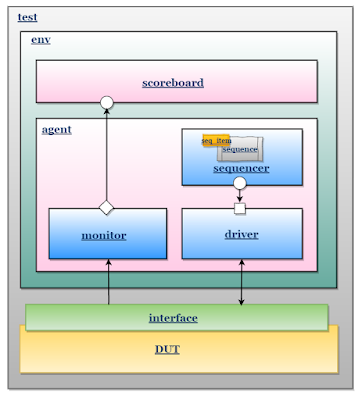
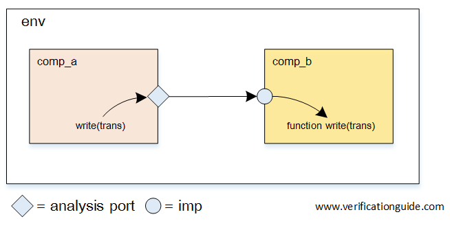
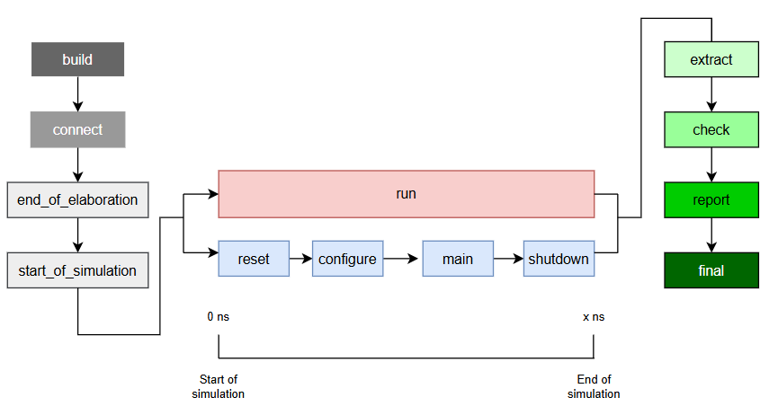

# UVM-Like Tutorial: Principles of Structured Verification

> **📚 Related Tutorial:** To learn how to set up the development environment with cocotb, Verilator, GTKWave, pyuvm and vsc see the [CocoTb Tutorial](CocoTb/CocoTb_Tutorial.md) and the [PyUVM Tutorial](PyUVM/PyUVM_Tutorial.md) . To learn how to run the verifications using Xcelium and debugging with SimVision check the [SystemVerilog Tutorial](SystemVerilog/SystemVerilog_Tutorial.md).

## 🧭 What is UVM and Structured Verification?

The **Universal Verification Methodology (UVM)** defines a widely adopted, standardized architecture for building scalable and reusable verification environments. While UVM is an official methodology for SystemVerilog, its core concepts—**modularity**, **reusability**, and **separation of concerns**—are fundamental to modern verification in any language, including **cocotb** using Python.

Structured verification aims to separate the **Device Under Test (DUT)** from the code that generates stimulus (inputs) and checks results. This modularity allows complex test scenarios to be built easily and verification components to be reused across different projects.

---

## 📚 UVM Library

The UVM Library is a framework that helps build structured, reusable testbenches without writing every base class from scratch. In SystemVerilog this comes from the IEEE UVM package and its macros, while in Python it is provided by `pyuvm`, which mirrors the same architecture using Python classes and helpers.

### SystemVerilog (UVM)

In SystemVerilog, the UVM library is imported through `uvm_pkg`, and macros are used to register components and objects in the factory. A package file is commonly used to aggregate all classes in the testbench, but the testbench top still needs to import the package to bring those types into scope.

<details>
<summary><strong>SystemVerilog Example (half_adder_pkg.sv)</strong></summary>

```sv
package half_adder_pkg;
        import uvm_pkg::*;

        `include "uvm_macros.svh"
        `include "pkt.sv"
        `include "my_sequencer.sv"
        `include "my_sequence.sv"
        `include "my_driver.sv"
        `include "my_monitor.sv"
        `include "my_agent.sv"
        `include "my_coverage.sv"
        `include "my_scoreboard.sv"
        `include "my_env.sv"
        `include "my_test.sv"

endpackage
```
</details>

<details>
<summary><strong>SystemVerilog Example (tb_top.sv)</strong></summary>

```sv
module tb_top;
    import half_adder_pkg::*;
    import uvm_pkg::*;
```
</details>
<br>

Macros start with the ` character and enable factory registration, standardized reporting, and other UVM utilities.

<details>
<summary><strong>SystemVerilog Example (uvm_component_utils.sv)</strong></summary>

```sv
class my_monitor extends uvm_monitor;
    `uvm_component_utils (my_monitor)
```
</details>

<details>
<summary><strong>SystemVerilog Example (uvm_object_utils.sv)</strong></summary>

```sv
class pkt extends uvm_sequence_item

    rand bit a;  
    rand bit b; 
    bit s;
    bit c;

    `uvm_object_utils_begin(pkt)
        `uvm_field_int (a, UVM_DEFAULT)
        `uvm_field_int (b, UVM_DEFAULT)
        `uvm_field_int (s, UVM_DEFAULT)
        `uvm_field_int (c, UVM_DEFAULT)
    `uvm_object_utils_end
```
</details>

<details>
<summary><strong>SystemVerilog Example (uvm_info.sv)</strong></summary>

```sv
virtual function void check_phase (uvm_phase phase);
    super.check_phase(phase);
    if (this.num_errors > 0) begin
        `uvm_fatal ("FINAL_RESULT", {$sformatf("TEST FAILED: Scoreboard found %0d errors.", num_errors)})
    end 
    else begin
        `uvm_info ("FINAL_RESULT", "TEST PASS: All transactions were correct.", UVM_NONE)
    end
endfunction
```
</details>
<br>

The factory method `type_id::create` builds factory-registered objects or components and enables overrides. If you instantiate with `new()`, overrides do not apply.

<details>
<summary><strong>SystemVerilog Example (factory_create.sv)</strong></summary>

```sv
virtual function void build_phase (uvm_phase phase);
        super.build_phase (phase); 

        if(get_is_active()) begin
                seqr = my_sequencer::type_id::create ("seqr", this);
                drv  = my_driver::type_id::create ("drv", this);
        end

        mon  = my_monitor::type_id::create ("mon", this);
```
</details>

### PyUVM (Python)

In PyUVM, the library is imported as a Python package. The same UVM structure is used (test, env, agent, driver, monitor, etc.), but organized as Python modules instead of `include` files. A single package file often aggregates the components for clean imports.

<details>
<summary><strong>PyUVM Example (pyuvm imports)</strong></summary>

```python
import pyuvm
from pyuvm import *
from MyPackage import *
```
</details>

<details>
<summary><strong>PyUVM Example (MyPackage.py)</strong></summary>

```python
from Pkt import Pkt
from MySequence import MySequence
from MySequencer import MySequencer
from MyDriver import MyDriver
from MyMonitor import MyMonitor
from MyAgent import MyAgent
from MyEnv import MyEnv
from MyScoreboard import MyScoreboard
from HalfAdderWrapper import HalfAdderWrapper
from MyCoverage import MyCoverage

__all__ = [
        "Pkt",
        "MySequence",
        "MySequencer",
        "MyDriver",
        "MyMonitor",
        "MyAgent",
        "MyEnv",
        "MyScoreboard",
        "HalfAdderWrapper",
        "MyCoverage"
]
```
</details>
<br>
PyUVM still uses the factory pattern via the `create()` helper on components and objects, so overrides can be applied consistently across tests.

<br>
<details>
<summary><strong>PyUVM Example (factory_create)</strong></summary>

```python
def build_phase(self):
        self.sequencer = MySequencer.create("sequencer", self)
        if self.is_active:
                self.driver = MyDriver.create("driver", self)
        self.monitor = MyMonitor.create("monitor", self)
```
</details>

## 🧱 UVM Base Classes

As seen in the project files, every class extends from an existing class of the UVM architecture. This makes the process of writing your own UVM testbench easier, because it is not needed to write and formulate every phase, every method, and every attribute of every class and subclass.


## 🏗️ UVM Architecture

The architecture organizes the verification components into a **Testbench Hierarchy**, as shown in the diagram:



The architecture is typically organized into a top-level **test** module, which manages the **environment (env)**, the **agent**, and the connection to the **interface** and the **DUT**.

---

### Transaction (Sequence Item)

The **Transaction** (or **Sequence Item**) is the fundamental data packet exchanged between verification components. It abstracts low-level signals into meaningful, high-level data.

**Role:** Defines the data structure representing a single operation on the DUT interface (e.g., an input set and expected output).

**Function:** The Transaction class is used to encapsulate meaningful data and control information for a specific operation. Components exchange these high-level objects instead of dealing with individual bits and pins.

<details>
<summary><strong>CocoTb Example (HalfAdderTransaction)</strong></summary>

```python
@dataclass
class HalfAdderTransaction:
    a: int
    b: int
    s: int = None # Sum (Output)
    c: int = None # Carry (Output)
```
</details>

<details>
<summary><strong>PyUVM Example (Pkt.py)</strong></summary>

```python
class Pkt(uvm_sequence_item):
    def __init__(self, name):
        super().__init__(name)
        self.c=0
        self.s=0
        self.a=0
        self.b=0

    def __str__(self):
        return (f"A={self.a}, B={self.b} -> S={self.s}, C={self.c}")
    
    def randomize(self):
        self.a=random.randint(0, 1)
        self.b=random.randint(0, 1)
```
</details>
This data class represents a single addition operation, encapsulating both inputs (`a`, `b`) and observed results (`s`, `c`).

<details>
<summary><strong>SystemVerilog Example (pkt.sv)</strong></summary>

```sv
class pkt extends uvm_sequence_item

    rand bit a;
    rand bit b;
    bit s;
    bit c;

    `uvm_object_utils_begin(pkt)
        `uvm_field_int (a, UVM_DEFAULT)
        `uvm_field_int (b, UVM_DEFAULT)
        `uvm_field_int (s, UVM_DEFAULT)
        `uvm_field_int (c, UVM_DEFAULT)
    `uvm_object_utils_end

    function new(string name = "pkt");
            super.new(name);
            this.c = '0;
            this.s = '0;
    endfunction

endclass
```
</details>


---

### Sequence

A **Sequence** defines a series of transactions to be executed.

**Role:** Implements the test stimulus scenarios.

**Function:** It generates `sequence_items` (Transactions), randomizes them, and sends them to the Sequencer. Sequences can implement complex logic, such as waiting for a specific coverage goal before finishing.

<details>
<summary><strong>PyUVM Example (MySequence.py)</strong></summary>

```python
class MySequence(uvm_sequence):

    def __init__(self, name):
        super().__init__(name)
        self.cov_handle=ConfigDB().get(uvm_root(), "", "COV_HANDLE") # Database configuration so it can access the coverage module

    async def body(self):
        while self.cov_handle.cg.get_coverage() < 100.00: # Creates packages until the coverage is complete (increases the sequence)
            sequence_packet=Pkt.create(f"packet")
            sequence_packet.randomize()
            await Timer(1, unit='step')
            await self.start_item(sequence_packet)
            await self.finish_item(sequence_packet)
```
</details>

<details>
<summary><strong>SystemVerilog Example (my_sequence.sv)</strong></summary>

```sv
class my_sequence extends uvm_sequence #(pkt);
    `uvm_object_utils(my_sequence)

    real current_coverage = 0;
    uvm_event cov_sampled_event;

    function new (string name = "my_sequence");
        super.new(name);
        cov_sampled_event = uvm_event_pool::get_global("cov_sampled");
    endfunction

    virtual task body();
        pkt packet;
        while (current_coverage < 100.0) begin
            `uvm_do(packet);

            cov_sampled_event.wait_trigger();
            void'(uvm_config_db#(real)::get(null, "*", "cov_status", current_coverage));

            `uvm_info("SEQ", $sformatf("Status: %0.2f%%", current_coverage), UVM_LOW)
        end
    endtask
endclass
```
</details>

---

### Sequencer

The **Sequencer** serves as an arbiter that controls the flow of transactions. Inside the `CocoTb` verification, the sequencer is not instantiated, but its function is still present. During the
`PyUVM` verification, the module (`Class`), is identically reconstructed from its parent class `uvm_sequencer`, but it is present in the files to clarify its existence.

**Role:** Manages the communication between Sequences and the Driver.

**Function:** It receives transaction items from sequences and routes them to the driver. In `pyuvm`, it ensures that the driver is ready to process a new item before sending it.

<details>
<summary><strong>PyUVM Example (MySequencer.py)</strong></summary>

```python
class MySequencer(uvm_sequencer):

    def __init__(self, name, parent):
        super().__init__(name, parent)
```
</details>

<details>
<summary><strong>SystemVerilog Example (my_sequencer.sv)</strong></summary>

```sv
class my_sequencer extends uvm_sequencer #(pkt);

    `uvm_component_utils (my_sequencer)

    function new (string name="m_sequencer", uvm_component parent);
        super.new (name, parent);
    endfunction

endclass
```
</details>

---

### Driver

The **Driver** is the active component responsible for taking a high-level transaction and translating it into low-level pin activity on the **interface** of the DUT.

**Role:** Drives stimulus onto the DUT.

**Function:** The Driver receives transactions from the sequencer and converts the high-level data into the corresponding signal toggling required to apply stimulus to the DUT. It acts as a functional model of an external device.

<details>
<summary><strong>CocoTb Example (HalfAdderDriver)</strong></summary>

```python
class Driver:
    # ... init method ...

    async def drive(self, tr: HalfAdderTransaction):
        # Translate transaction data to DUT signals
        self.dut.a.value = tr.a
        self.dut.b.value = tr.b
        await Timer(10, unit='ns') # Wait for timing/settling
```
</details>

<details>
<summary><strong>PyUVM Example (MyDriver.py)</strong></summary>

```python
class MyDriver(uvm_driver):
    # ... init method ...

    def build_phase(self):
        self.bfm = ConfigDB().get(self, "", "BUS_BFM") # Retrieve the BFM handle

    async def run_phase(self):
        while True:
            packet=await self.seq_item_port.get_next_item() # Retrieves another packet from the sequencer (this sequencer port is later defined)
            await self.bfm.send_pkt(packet)
            self.seq_item_port.item_done()
```
</details>

<details>
<summary><strong>SystemVerilog Example (my_driver.sv)</strong></summary>

```sv
virtual function void build_phase (uvm_phase phase);
    super.build_phase(phase);
    if (! uvm_config_db #(virtual dut_if) :: get (this, "", "vif", vif)) begin
        `uvm_fatal (get_type_name (), "Didn't get handle to virtual interface if_name")
    end
endfunction

virtual task run_phase(uvm_phase phase);
    super.run_phase(phase);

    forever begin
        seq_item_port.get_next_item(req_pkt);
        drive_item(req_pkt);
        seq_item_port.item_done();
    end
endtask

virtual task drive_item (pkt pkt_item);
    @(posedge vif.clk);
    vif.data_bus_in[0] <= pkt_item.a;
    vif.data_bus_in[1] <= pkt_item.b;
    vif.data_bus_in[3:2] <= 2'b0;

    wait(vif.valid_out == '0)
        vif.valid_in <= 1'b1;

    @(posedge vif.clk);
    vif.valid_in <= 1'b0;
endtask
```
</details>

---

### Monitor

The **Monitor** is a passive component that observes activity on the DUT interface. It watches the low-level signals and reconstructs them into high-level transactions.

**Role:** Observes interface activity and broadcasts transactions to checking components (like the Scoreboard).

**Function:** The Monitor reads the pin-level signals on the interface and converts this low-level activity back into high-level transaction objects. It then sends these observed transactions to the scoreboard for checking and coverage components for data collection.

<details>
<summary><strong>CocoTb Example (HalfAdderMonitor)</strong></summary>

```python
class Monitor:
    # ... init method ...

    async def run(self):
        # Wait for outputs to settle (timing is critical in verification!)
        await Timer(9, unit='ns') 
        
        # Read low-level signals and create a high-level transaction
        tr = HalfAdderTransaction(
            a=self.dut.a.value, b=self.dut.b.value,
            s=self.dut.s.value, c=self.dut.c.value
        )
        
        # Send the observed transaction to the Scoreboard
        if self.scoreboard_callback:
            self.scoreboard_callback(tr)
```
</details>

<details>
<summary><strong>PyUVM Example (MyMonitor.py)</strong></summary>

```python
class MyMonitor(uvm_monitor):
    # ... init method ...
    
    def build_phase(self):
        self.ap=uvm_analysis_port("ap", self) # Creates and analysis port, use to send packets to the scoreboard and the coverage module
        self.bfm = ConfigDB().get(self, "", "BUS_BFM")

    async def run_phase(self):
        while True:
            result=await self.bfm.get_result()
            self.logger.debug(f"MONITORED {result}")
            packet=Pkt("monitored_packet")
            packet.a=result[0] # Packs the result of the DUT into a packet instance
            packet.b=result[1]
            packet.s=result[2]
            packet.c=result[3]
            self.ap.write(packet) # Sends the packet to the analysis port
```
</details>

<details>
<summary><strong>SystemVerilog Example (my_monitor.sv)</strong></summary>

```sv
virtual dut_if vif;

uvm_analysis_port  #(pkt) mon_analysis_port;

virtual function void build_phase (uvm_phase phase);
    super.build_phase (phase);

    mon_analysis_port = new ("mon_analysis_port", this);

   if (! uvm_config_db #(virtual dut_if) :: get (this, "", "vif", vif)) begin
      `uvm_error (get_type_name(), "DUT interface not found")
   end  
endfunction

virtual task run_phase (uvm_phase phase);
    pkt mon_pkt = pkt::type_id::create("mon_pkt", this);

    super.run_phase(phase);

    forever begin
        @(posedge vif.valid_out);
        mon_pkt.a = vif.data_bus_out[0];
        mon_pkt.b = vif.data_bus_out[1];
        mon_pkt.c = vif.data_bus_out[2];
        mon_pkt.s = vif.data_bus_out[3];

        mon_analysis_port.write(mon_pkt);
    end
endtask
```
</details>

---

### Agent

The **Agent** groups the components that verify a single interface (Driver, Sequencer, and Monitor). Like the **Sequencer**, this module may not be explicitly present in the `CocoTb` verification.

**Role:** Encapsulates the verification functionality for one specific interface of the DUT.

**Function:** It manages the instantiation and connection of the Driver, Sequencer, and Monitor.

<details>
<summary><strong>PyUVM Example (MyAgent.py)</strong></summary>

```python
class MyAgent(uvm_agent):
    # ... init method ...
        self.sequencer=None
        self.is_active=is_active # An agente can be inactive, meaning it would not send any signal, only monitor them

    def build_phase(self):
        self.sequencer=MySequencer.create("sequencer", self)
        if self.is_active:
            self.driver=MyDriver.create("driver", self)
        self.monitor=MyMonitor.create("monitor", self)

    def connect_phase(self):
        if self.is_active:
            self.driver.seq_item_port.connect(self.sequencer.seq_item_export) # Connects the sequencer port to the driver port
```
</details>

<details>
<summary><strong>SystemVerilog Example (my_agent.sv)</strong></summary>

```sv
my_driver drv;
my_monitor mon;
my_sequencer seqr;

virtual function void build_phase (uvm_phase phase);
    super.build_phase (phase);

    if(get_is_active()) begin
        seqr = my_sequencer::type_id::create ("seqr", this);
        drv  = my_driver::type_id::create ("drv", this);
    end

    mon  = my_monitor::type_id::create ("mon", this);
endfunction

virtual function void connect_phase (uvm_phase phase);
    super.connect_phase(phase);
    if (get_is_active()) begin
        drv.seq_item_port.connect (seqr.seq_item_export);
    end
endfunction
```
</details>

--- 

### BFM (Bus Functional Model) / Wrapper

The **BFM** acts as the functional interface between the verification environment and the hardware signals.

**Role:** Bridges the gap between high-level Python commands and low-level DUT pins.

**Function:** It encapsulates cocotb signal assignments and timing (like RisingEdge) inside asynchronous methods. This allows the rest of the UVM components to remain independent of the specific hardware implementation.

<details>
<summary><strong>PyUVM Example (HalfAdderWrapper.py)</strong></summary>

```python
class HalfAdderWrapper:
    def __init__(self):
        self.dut = cocotb.top
        self.driver_queue = Queue(maxsize=1)
        self.mon_queue = Queue(maxsize=0) 
        self.ack_event = Event()
        self.stimulus_event = Event()
        self.ack_event.set() 

    async def send_pkt(self, packet):
        await self.ack_event.wait()
        self.ack_event.clear()
        await self.driver_queue.put(packet)

    async def driver_task(self):
        while True:
            packet = await self.driver_queue.get() 
            
            self.dut.a.value = packet.a
            self.dut.b.value = packet.b 
            self.stimulus_event.set()

    async def get_result(self):
        return await self.mon_queue.get()
    
    async def monitor_task(self):
        while True:
            await self.stimulus_event.wait()
            self.stimulus_event.clear()
            
            A_in = self.dut.a.value
            B_in = self.dut.b.value
            S_out = self.dut.s.value
            C_out = self.dut.c.value
            
            self.mon_queue.put_nowait((A_in, B_in, S_out, C_out))
            
            self.ack_event.set()
            
    def start_bfm(self):
        cocotb.start_soon(self.driver_task())
        cocotb.start_soon(self.monitor_task())
```
</details>

<details>
<summary><strong>SystemVerilog Example (DUT Wrapper)</strong></summary>

```sv
module half_adder_wrapper (dut_if vif);
    logic c, s;

    half_adder DUT(.a(vif.data_bus_in[0]), .b(vif.data_bus_in[1]), .c(c), .s(s));

    always@(posedge vif.clk) begin :reset
        if(vif.rst) begin
            vif.data_bus_in <= '0;
            vif.data_bus_out <= '0;
            vif.valid_in <= '0;
            vif.valid_out <= '0;
        end
        if(vif.valid_in == 1) begin
            vif.data_bus_out[0] <= DUT.a;
            vif.data_bus_out[1] <= DUT.b;
            vif.data_bus_out[2] <= DUT.c;
            vif.data_bus_out[3] <= DUT.s;
            vif.valid_out <= '1;
        end
        else begin
            vif.valid_out <= '0;
        end
    end
endmodule
```
</details>


<details>
<summary><strong>SystemVerilog Example (Interface)</strong></summary>

```sv
interface dut_if (clk, rst);


    input bit clk;
    input logic rst;        

    logic valid_in;          
    logic valid_out;         
    logic [3:0] data_bus_in; 
    logic [3:0] data_bus_out;

endinterface
```
</details>

---


### Scoreboard

The **Scoreboard** is the verification component responsible for checking the DUT's functional correctness. It is often the most complex component, as it must contain a **Reference Model** (or "golden model").

**Role:** Compares the actual DUT outputs (from the Monitor) with the expected results (from its internal Reference Model).

**Function:**
1.  **Reference Model:** It implements a reference model to calculate the expected output based on the input transactions.
2.  **Checking:** Receives the actual results (from the Monitor) and performs the comparison. 

<details>
<summary><strong>CocoTb Example (HalfAdderScoreboardRefModel)</strong></summary>

```python
def ref_model(self, tr: HalfAdderTransaction):
    def ref_model(self, tr: HalfAdderTransaction):
        s_expected = tr.a ^ tr.b # XOR for Sum
        c_expected = tr.a & tr.b # AND for Carry
        self.expected_queue.append({  # Queue the expected results..
            "inputs": (tr.a, tr.b),
            "outputs": (s_expected, c_expected)
        })
```
</details>

<details>
<summary><strong>CocoTb Example (HalfAdderScoreboardChecking)</strong></summary>

```python
    def check_actual(self, actual_tr: HalfAdderTransaction):
        if not self.expected_queue:
            print("[SCOREBOARD FAIL] Received a DUT result without an expected value!")
            self.errors += 1
            return

        expected = self.expected_queue.pop(0)
        expected_s, expected_c = expected["outputs"] # Dequeue the expected result
        actual_s, actual_c = actual_tr.s, actual_tr.c

        if expected_s == actual_s and expected_c == actual_c: # Compare with actual_tr.s and actual_tr.c
            print(f"[SCOREBOARD PASS] a={actual_tr.a}, b={actual_tr.b} -> s={actual_s}, c={actual_c}") # ... report PASS/FAIL ...
        else:
            print(f"[SCOREBOARD FAIL] Para a={actual_tr.a}, b={actual_tr.b}:")
            print(f"  -> Expected: s={expected_s}, c={expected_c}")
            print(f"  -> Received: s={actual_s}, c={actual_c}")
            self.errors += 1
```
</details>

<details>
<summary><strong>PyUVM Example (GoldenModel.py)</strong></summary>

```python
class GoldenModel():
    def __init__(self):
        self.s=0
        self.c=0

    def check(self, packet):
        self.s=packet.a ^ packet.b
        self.c = packet.a & packet.b

        if packet.s == self.s and packet.c == self.c:
            return True
        else:
            return False
```
</details>

<details>
<summary><strong>PyUVM Example (MyScoreboard.py)</strong></summary>

```python
class MyScoreboard(uvm_scoreboard):

    num_errors=0

    # ... init method ...
    
    def build_phase(self):
        self.fifo=uvm_tlm_analysis_fifo("fifo", self) # Instantiates the Scoreboard analysis port
        self.analysis_export=self.fifo.analysis_export # Port that conects to the Monitor
        self.golden_model=GoldenModel()

    async def run_phase(self):
        self.logger.info("Scoreboard iniciando checagem...")
        while True:
            pkt = await self.fifo.get()

            if self.golden_model.check(pkt):
                self.logger.info(
                    f"PASS: A={pkt.a}, B={pkt.b} -> S={pkt.s}, C={pkt.c}")
            else:
                self.num_errors += 1
                self.logger.error(
                    f"FAIL: A={pkt.a}, B={pkt.b}. EXPECTED S={self.golden_model.s}, C={self.golden_model.c}. RECEIVED S={pkt.s}, C={pkt.c}"
                )

    def check_phase(self):
        if self.num_errors > 0:
            self.logger.fatal(f"TEST FAILED: Scoreboard found {self.num_errors} errors.")
        else:
            self.logger.info("TEST PASS: Todas as transações foram corretas.")
```
</details>

<details>
<summary><strong>SystemVerilog Example (my_scoreboard.sv)</strong></summary>

```sv
uvm_analysis_imp #(pkt, my_scoreboard) ap_imp;

int num_errors = 0;

virtual function void build_phase (uvm_phase phase);
    super.build_phase (phase);
    ap_imp = new ("ap_imp", this);
endfunction

virtual function void write (pkt data);

    bit expected_s; 
    bit expected_c; 
    
    expected_s = data.a ^ data.b; 
    expected_c = data.a & data.b; 

    if (data.s == expected_s && data.c == expected_c) begin
        `uvm_info ("SCOREBOARD", {$sformatf("PASS: A=%0d, B=%0d -> S=%0d, C=%0d", data.a, data.b, data.s, data.c)}, UVM_LOW)
    end 
    else begin
    string msg = {"FAIL: A=", $sformatf("%0d", data.a),
                    ", B=", $sformatf("%0d", data.b),
                    ". EXPECTED S=", $sformatf("%0d", expected_s),
                    ", RECEIVED S=", $sformatf("%0d", data.s)};

        `uvm_error ("SCOREBOARD", msg)
        this.num_errors++; 
    end
endfunction
```
</details>

---

### Coverage

**Coverage** is used to measure how much of the design functionality has been exercised by the tests.

**Role:** Tracks input combinations and design states to ensure the verification plan is met.

**Function:** Using libraries like `vsc`, we can define covergroups and bins to monitor if all possible scenarios (e.g., all combinations of A and B in a Half Adder) were tested.

**Covergroup:** A structured set of coverpoints (and optional crosses) that defines what signals or transactions will be sampled for coverage.

**Bins:** Buckets inside a coverpoint that count how many times specific values or ranges occur; coverage is reached when all bins of interest are hit.

<details>
<summary><strong>PyUVM Example (HalfAdderCovergroup.py)</strong></summary>

```python
@covergroup
class HalfAdderCovergroup():

    def __init__(self):
        self.with_sample(
            a=bit_t(1),
            b=bit_t(1)
        )
        self.cp1 = coverpoint(self.a, bins={
            "a_0" : bin(0), "a_1" : bin(1)
            })
        self.cp2 = coverpoint(self.b, bins={
            "b_o" : bin(0), "b_1" : bin(1)
            })

        self.cp1X2 = cross([self.cp1, self.cp2]) # Cross covers all possibilities: 00, 01, 10, 11
```
</details>

<details>
<summary><strong>PyUVM Example (MyCoverage.py)</strong></summary>

```python
class MyCoverage(uvm_subscriber):
    def build_phase(self):
        self.cg=HalfAdderCovergroup()

    def write(self, pkt):

        self.cg.sample(pkt.a, pkt.b) # Automatically sampled when the Monitor writes at the analysis port (because of the parent class uvm_subscriber)

    def report_phase(self):

        cg_percent = self.cg.get_coverage()

        if cg_percent < 100.0:
            self.logger.error(
                f"Coverage FAIL: {100 - cg_percent:.2f}% uncovered."
            )
            assert False
        else:
            self.logger.info(f"Covered all operations (100.00%)")
            assert True

    def get_my_coverage(self):
        return self.cg.get_coverage()
```
</details>

<details>
<summary><strong>SystemVerilog Example (coverage.sv)</strong></summary>

```sv
pkt tr;
uvm_event cov_sampled_event;

covergroup cg_adder;
    option.per_instance = 1;
    cp_a: coverpoint tr.a;
    cp_b: coverpoint tr.b;
    cross_ab: cross cp_a, cp_b;
endgroup

virtual function void write(pkt t);
    this.tr = t;
    cg_adder.sample();
    uvm_config_db#(real)::set(null, "*", "cov_status", cg_adder.get_inst_coverage());
    cov_sampled_event.trigger();
endfunction
```
</details>

---

### Environment

The **Environment** is the container that organizes the reusable components (Driver, Monitor, Scoreboard, Agent, etc.). It is responsible for **instantiating** all these pieces and making all the necessary **connections** (like wiring the Monitor's output to the Scoreboard's input).

**Role:** Instantiates, configures, and connects all the lower-level verification components.

**Function:** The Environment ensures that all components that verify a system are correctly instantiated and interconnected, managing the overall configuration of the testbench.

<details>
<summary><strong>CocoTb Example (HalfAdderEnviroment)</strong></summary>

```python
class Environment:
    def __init__(self, dut):
        self.dut = dut
        self.driver = Driver(dut)
        self.monitor = Monitor(dut)
        self.scoreboard = Scoreboard()
        
        # Connection: Linking Monitor output to Scoreboard input
        self.monitor.scoreboard_callback = self.scoreboard.check_actual
```
</details>

<details>
<summary><strong>PyUVM Example (MyEnviroment.py)</strong></summary>

```python
class MyEnv(uvm_env):
    # ... init method ...
    
    def build_phase(self):
        self.agent=MyAgent.create("agent", self)
        self.scoreboard=MyScoreboard.create("scoreboard", self)
        self.coverage=MyCoverage.create("coverage", self)
        ConfigDB().set(uvm_root(), "", "SEQR", self.agent.sequencer)
        ConfigDB().set(uvm_root(), "", "COV_HANDLE", self.coverage) 

    def connect_phase(self):
        self.agent.monitor.ap.connect(self.scoreboard.analysis_export) # Ports connection
        self.agent.monitor.ap.connect(self.coverage.analysis_export)
```
</details>

<details>
<summary><strong>SystemVerilog Example (my_env.sv)</strong></summary>

```sv
my_agent agent;
my_scoreboard scoreboard;
my_coverage coverage;
    
virtual function void build_phase (uvm_phase phase);
    super.build_phase (phase);
    agent = my_agent::type_id::create ("agent", this);
    scoreboard = my_scoreboard::type_id::create ("scoreboard", this);
    coverage = my_coverage::type_id::create ("coverage", this);
endfunction

virtual function void connect_phase (uvm_phase phase);
    super.connect_phase (phase);
    agent.mon.mon_analysis_port.connect(scoreboard.ap_imp);
    agent.mon.mon_analysis_port.connect(coverage.analysis_export);
endfunction
```
</details>

---

### Test

The **Test** class is responsible for setting up the environment, generating test scenarios (sequences of transactions), and reporting the final result.

**Role:** Defines the test scenario and controls the flow of transactions.

**Function:** The Test class configures the environment components (e.g., setting constraints for the stimulus), runs the test flow, and performs the final check of the scoreboard results to determine if the verification passed or failed.

<details>
<summary><strong>CocoTb Example (HalfAdderTest)</strong></summary>

```python
@cocotb.test()
async def half_adder_uvm_test(dut):
    # 1. Setup Environment
    env = Environment(dut)
    test_vectors = [(0,0), (0,1), (1,0), (1,1)]

    # 2. Stimulus Generation and Verification Loop
    for a, b in test_vectors:
        tr = HalfAdderTransaction(a=a, b=b)
        env.scoreboard.ref_model(tr) # Predict expected result
        await env.driver.drive(tr)   # Drive inputs to DUT
        await env.monitor.run()      # Monitor actual results

    # 3. Final Check
    assert env.scoreboard.errors == 0, f"Scoreboard found {env.scoreboard.errors} errors."
```
</details>

<details>
<summary><strong>PyUVM Example (MyTest.py)</strong></summary>

```python
@pyuvm.test()
class MyTest(uvm_test):    
    def build_phase(self):
        self.env=MyEnv.create("env", self)
        self.bfm = HalfAdderWrapper()
        ConfigDB().set(self, "*", "BUS_BFM", self.bfm)
        self.bfm.start_bfm()

    async def run_phase(self):

        self.raise_objection()

        await Timer(2, unit="ns")

        seqr=self.env.agent.sequencer
        seq=MySequence.create("seq") # Note that the Sequence wasn't instantiated anywhere before
        await seq.start(seqr)

        self.drop_objection()
```
</details>

<details>
<summary><strong>SystemVerilog Example (tb_top.sv)</strong></summary>

```sv
module tb_top;
    import half_adder_pkg::*;
    import uvm_pkg::*;

    bit clk;
    bit rst;

    dut_if vif (.clk(clk), .rst(rst));
    half_adder_wrapper dut(.vif(vif));

    always #10 clk = ~clk;

    initial begin
        clk = 0;

        rst = 1;

        #100 rst = 0;
    end

    initial begin
        uvm_config_db #(virtual dut_if)::set(null, "*", "vif", vif);
        
        run_test("my_test");
    end
endmodule
```
</details>

---

## 🔗 TLM

Transaction-Level Modeling (TLM) is a communication style where components exchange transactions (objects) instead of low-level signals. In UVM, this appears as TLM ports/exports (like `uvm_analysis_port`, `uvm_analysis_imp`, and `seq_item_port`) that pass `pkt` items between sequencer, driver, monitor, scoreboard, and coverage. It is good practice because it decouples components, improves reuse, and makes it easier to swap or extend parts of the testbench without changing the data flow.



In the diagram, two components share a TLM channel and use the same function `write` to communicate, just like the `Monitor` and the `Scoreboard` do in the verification examples.

<details>
<summary><strong>SystemVerilog Example (monitor_analysis_port.sv)</strong></summary>

```sv
class my_monitor extends uvm_monitor;
  `uvm_component_utils (my_monitor)

  virtual dut_if vif;

  uvm_analysis_port  #(pkt) mon_analysis_port;
```
</details>

<details>
<summary><strong>SystemVerilog Example (scoreboard_analysis_imp.sv)</strong></summary>

```sv
class my_scoreboard extends uvm_scoreboard;
    `uvm_component_utils (my_scoreboard)

    uvm_analysis_imp #(pkt, my_scoreboard) ap_imp;
```
</details>

<details>
<summary><strong>PyUVM Example (analysis_port + analysis_fifo)</strong></summary>

```python
class MyMonitor(uvm_monitor):
    def build_phase(self):
        self.ap=uvm_analysis_port("ap", self)

class MyScoreboard(uvm_scoreboard):
    def build_phase(self):
        self.fifo=uvm_tlm_analysis_fifo("fifo", self)
        self.analysis_export=self.fifo.analysis_export
```
</details>

<details>
<summary><strong>CocoTb Example (callback channel)</strong></summary>

```python
class Monitor:
    def __init__(self, dut):
        self.dut = dut
        self.scoreboard_callback = None

    async def run(self):
        tr = HalfAdderTransaction(
            a=self.dut.a.value, b=self.dut.b.value,
            s=self.dut.s.value, c=self.dut.c.value
        )
        if self.scoreboard_callback:
            self.scoreboard_callback(tr)

class Environment:
    def __init__(self, dut):
        self.monitor = Monitor(dut)
        self.scoreboard = Scoreboard()
        self.monitor.scoreboard_callback = self.scoreboard.check_actual
```
</details>

## ⏱️ UVM Phases

Each phase in the UVM flow has a specific goal. Because we are dealing with classes like `my_agent` that extend from `uvm_agent`, we do not need to explicitly declare every phase, only the ones we want to override. The most common phases are `connect_phase`, `run_phase`, and `check_phase`. For phases that are explicitly declared, the parent class phase has to be executed first with the `super` method.



### Build Phase

In this phase, the components like the `Driver`, `Agent`, and others are built. In an `uvm_component` extended class, it is required to build the parent class before doing anything else in the `build_phase` function. In the example below, the `Monitor` has to first build its parent class (`super.build_phase(phase)`) so it can later create its analysis port and get the test interface. This is necessary for other components too.

<details>
<summary><strong>SystemVerilog Example (build_phase.sv)</strong></summary>

```sv
virtual function void build_phase (uvm_phase phase);
    super.build_phase (phase);

    mon_analysis_port = new ("mon_analysis_port", this);

   if (! uvm_config_db #(virtual dut_if) :: get (this, "", "vif", vif)) begin
      `uvm_error (get_type_name(), "DUT interface not found")
   end  
endfunction
```
</details>

<details>
<summary><strong>PyUVM Example (build_phase)</strong></summary>

```python
def build_phase(self):
    self.env=MyEnv.create("env", self)
    self.bfm = HalfAdderWrapper()
    ConfigDB().set(self, "*", "BUS_BFM", self.bfm)
    self.bfm.start_bfm()
```
</details>

### Connect Phase

Here, the connections between components are made, so the flow of packets in the verification can happen. The `Agent` is the best example for this phase, because it connects the `Sequencer` to the `Driver`, making the flow of packets possible. Also note that if the agent is not active (only reads the outputs using the monitor), the ports are not connected.

<details>
<summary><strong>SystemVerilog Example (connect_phase.sv)</strong></summary>

```sv
virtual function void connect_phase (uvm_phase phase);
    super.connect_phase(phase);
    if (get_is_active()) begin
        drv.seq_item_port.connect (seqr.seq_item_export);
    end
endfunction
```
</details>

<details>
<summary><strong>PyUVM Example (connect_phase)</strong></summary>

```python
def connect_phase(self):
    if self.is_active:
        self.driver.seq_item_port.connect(self.sequencer.seq_item_export)
```
</details>

### End of Elaboration Phase

As the name suggests, in this phase the elaboration of the UVM architecture is complete; the components are registered, built, and connected. In the examples available now, it was only used to print the UVM topology in the `Test` class, checking if everything is in place as it should be.

<details>
<summary><strong>SystemVerilog Example (end_of_elaboration_phase.sv)</strong></summary>

```sv
virtual function void end_of_elaboration_phase (uvm_phase phase);
    uvm_top.print_topology ();
endfunction
```
</details>

### Run Phase

Maybe the most important phase, when packets start to be created, randomized, and sent to the `DUT`. In the `Driver` example, the `run_phase` is when it starts getting packets from the sequencer and driving them to the interface.

<details>
<summary><strong>SystemVerilog Example (run_phase.sv)</strong></summary>

```sv
virtual task run_phase(uvm_phase phase);
    super.run_phase(phase);

    forever begin
        seq_item_port.get_next_item(req_pkt);

        drive_item(req_pkt);

        seq_item_port.item_done();
    end
endtask
```
</details>

<details>
<summary><strong>PyUVM Example (run_phase)</strong></summary>

```python
async def run_phase(self):
    self.raise_objection()

    await Timer(2, unit="ns")

    seqr=self.env.agent.sequencer
    seq=MySequence.create("seq")
    await seq.start(seqr)

    self.drop_objection()
```
</details>

### Check Phase

In this moment, the verification is in its final steps. The `Scoreboard` example shows that the `check_phase` is responsible for checking if the verification had any functional errors.

<details>
<summary><strong>SystemVerilog Example (check_phase.sv)</strong></summary>

```sv
virtual function void check_phase (uvm_phase phase);
    super.check_phase(phase);
    if (this.num_errors > 0) begin
        `uvm_fatal ("FINAL_RESULT", {$sformatf("TEST FAILED: Scoreboard encontrou %0d erros.", num_errors)})
    end 
    else begin
        `uvm_info ("FINAL_RESULT", "TEST PASS: Todas as transacoes foram corretas.", UVM_NONE)
    end
endfunction
```
</details>

<details>
<summary><strong>PyUVM Example (check_phase)</strong></summary>

```python
def check_phase(self):
    if self.num_errors > 0:
        self.logger.fatal(f"TEST FAILED: Scoreboard encontrou {self.num_errors} erros.")
    else:
        self.logger.info("TEST PASS: Todas as transacoes foram corretas.")
```
</details>