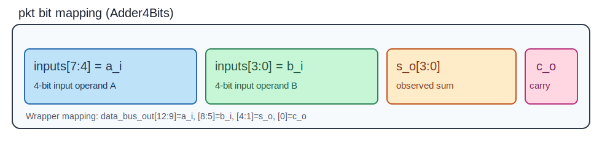

# Tutorial: Verifying an Adder4Bits using SystemVerilog UVM

This tutorial verifies `adder_4bits.sv` using a SystemVerilog UVM testbench. The structure follows the same style used in the FullAdder tutorial, adapted for 4-bit operands and a `randc`-driven packet flow.

## File Structure
```bash
ip-cores-sv/Adder4Bits/
├── adder_4bits.sv
├── half_adder.sv
├── full_adder.sv
├── adder_4bits_wrapper.sv
├── dut_if.sv
├── adder_4bits_pkg.sv
├── pkt.sv
├── my_sequence.sv
├── my_sequencer.sv
├── my_driver.sv
├── my_monitor.sv
├── my_agent.sv
├── my_coverage.sv
├── my_scoreboard.sv
├── my_env.sv
├── my_test.sv
├── tb_top.sv
├── run.f
└── Makefile
```

## The DUT
The DUT is a 4-bit adder (`adder_4bits.sv`) built with one `half_adder` stage followed by three `full_adder` stages. It computes:
- `s_o = a_i + b_i` (lower 4 bits)
- `c_o = carry-out`

To see more details about the RTL design style, check the [Adder4Bits RTL Design](https://github.com/UVMUFSC/IP-Cores/tree/main/ip-cores/adder-4bits)..

## Verification Logic
- `tb_top`: instantiates `dut_if` and `adder_4bits_wrapper`, drives clock/reset, places `vif` into `uvm_config_db`, and calls `run_test`.
- `adder_4bits_pkg`: central include point for all UVM classes and macros.
- `my_env`: creates `my_agent`, `my_scoreboard`, and `my_coverage` and connects analysis ports.
- `my_agent`: encapsulates `my_sequencer`, `my_driver`, and `my_monitor`.
- `my_driver`: drives the packet input bus and asserts `valid_in`.
- `my_monitor`: samples outputs when `valid_out` is asserted and publishes `pkt` transactions.
- `my_scoreboard`: compares observed outputs with expected 4-bit addition results.

## Packet / Sequence Item (`pkt`)
The `pkt` class is the sequence item used across the environment.
- `inputs[7:0]` is the randomized field (`randc`) that groups all DUT inputs.
- `inputs[7:4] = a_i` and `inputs[3:0] = b_i`.
- `s_o[3:0]` and `c_o` are observed outputs captured by the monitor.

Using one `randc bit [7:0] inputs` guarantees a non-repeated full permutation of all 256 input combinations before repeating values.



### Packet (actual implementation)
```sv
class pkt extends uvm_sequence_item;

  randc bit [7:0] inputs;
  bit [3:0] s_o;
  bit c_o;

  `uvm_object_utils_begin(pkt)
  `uvm_field_int (inputs, UVM_DEFAULT)
  `uvm_field_int (s_o, UVM_DEFAULT)
  `uvm_field_int (c_o, UVM_DEFAULT)
  `uvm_object_utils_end

  function new(string name = "pkt");
    super.new(name);
    this.c_o = '0;
    this.s_o = '0;
  endfunction

endclass
```

## Interface and Buses (`dut_if`)
The interface provides a simple handshake and two data buses:
- `data_bus_in[7:0]`: the driver places `a_i` on `[7:4]` and `b_i` on `[3:0]`.
- `data_bus_out[12:0]`: the wrapper places `a_i`, `b_i`, `s_o`, and `c_o` on `[12:9]`, `[8:5]`, `[4:1]`, and `[0]` respectively.
- `valid_in`: asserted by the driver to indicate valid inputs.
- `valid_out`: asserted by the wrapper when outputs are ready.

## Wrapper Behavior (`adder_4bits_wrapper`)
The wrapper connects the DUT to the interface and implements a handshake pipeline:
- On reset, it only clears DUT-driven observation signals (`data_bus_out` and `valid_out`).
- `valid_in` and `data_bus_in` remain verification-owned and are controlled by the driver/testbench.
- When `valid_in` is high, the wrapper captures DUT outputs and raises `valid_out` for monitor sampling.

## Sequence and `randc` flow (`my_sequence`)
The sequence creates the packet once and reuses the same object throughout the loop. This preserves `randc` history across transactions. The structure was changed by removing the `uvm_do` macro from the loop, adding the `uvm_create` macro outside the loop and the `uvm_rand_send` inside.

- Packet object is created before the loop.
- Each loop iteration randomizes the same packet object.
- A packet counter tracks sent transactions and shows the final total.

With `randc bit [7:0]`, the expected full cycle is exactly 256 packets. There is a new variable `num_packets` to check that, and the result can be seen in the `Console Output` section.

### Sequence (actual implementation)
```sv
class my_sequence extends uvm_sequence #(pkt);
  `uvm_object_utils(my_sequence)

  real current_coverage = 0;
  uvm_event cov_sampled_event;
  int num_packets = 0;

  function new (string name = "my_sequence");
    super.new(name);
    cov_sampled_event = uvm_event_pool::get_global("cov_sampled");
  endfunction

  virtual task body();
    pkt packet;
    `uvm_create(packet)
    while (current_coverage < 100.0) begin
      `uvm_rand_send(packet)

      num_packets++;

      cov_sampled_event.wait_trigger();

      void'(uvm_config_db#(real)::get(null, "*", "cov_status", current_coverage));

      `uvm_info("SEQ", $sformatf("Status: %0.2f%%", current_coverage), UVM_LOW)
    end

    `uvm_info("SEQ", $sformatf("Total packets sent: %0d", num_packets), UVM_LOW)
  endtask
endclass
```

## Coverage (actual implementation)
Coverage checks the 4-bit input cross space:
- `cp_a_i`: coverpoint for `inputs[7:4]`
- `cp_b_i`: coverpoint for `inputs[3:0]`
- `cross_ab`: cross of both coverpoints (256 combinations)

```sv
class my_coverage extends uvm_subscriber #(pkt);
  `uvm_component_utils(my_coverage)

  pkt tr;
  uvm_event cov_sampled_event;

  covergroup cg_adder;
  option.per_instance = 1;
  cp_a_i: coverpoint tr.inputs[7:4];
  cp_b_i: coverpoint tr.inputs[3:0];
  cross_ab: cross cp_a_i, cp_b_i;
  endgroup

  function new(string name, uvm_component parent);
  super.new(name, parent);
  cg_adder = new();
  cg_adder.set_inst_name("adder_cov");
  cov_sampled_event = uvm_event_pool::get_global("cov_sampled");
  endfunction

  virtual function void write(pkt t);
  this.tr = t;
  cg_adder.sample();
  uvm_config_db#(real)::set(null, "*", "cov_status", cg_adder.get_inst_coverage());
  cov_sampled_event.trigger();
  endfunction
endclass
```

## Scoreboard (actual implementation)
```sv
class my_scoreboard extends uvm_scoreboard;
  `uvm_component_utils (my_scoreboard)

  uvm_analysis_imp #(pkt, my_scoreboard) ap_imp;
  int num_errors = 0;

  function new (string name = "my_scoreboard", uvm_component parent = null);
    super.new (name, parent);
  endfunction

  virtual function void build_phase (uvm_phase phase);
    super.build_phase (phase);
    ap_imp = new ("ap_imp", this);
  endfunction

  virtual function void write (pkt data);
    bit [4:0] temp;
    bit [3:0] expected_sum;
    bit expected_carry;
    bit [3:0] a_i;
    bit [3:0] b_i;

    a_i = data.inputs[7:4];
    b_i = data.inputs[3:0];

    temp = {1'b0, a_i} + {1'b0, b_i};
    expected_sum = temp[3:0];
    expected_carry = temp[4];

    if ((data.s_o == expected_sum) && (data.c_o == expected_carry)) begin
      `uvm_info ("SCOREBOARD", {$sformatf("PASS: A=%0d, B=%0d -> SUM=%0d, CO=%0d", a_i, b_i, data.s_o, data.c_o)}, UVM_LOW)
    end
    else begin
      string msg = {"FAIL: A=", $sformatf("%0d", a_i),
              ", B=", $sformatf("%0d", b_i),
              ". EXPECTED SUM=", $sformatf("%0d", expected_sum),
              ", GOT SUM=", $sformatf("%0d", data.s_o),
              ", EXPECTED CO=", $sformatf("%0d", expected_carry),
              ", GOT CO=", $sformatf("%0d", data.c_o)};

      `uvm_error ("SCOREBOARD", msg)
      this.num_errors++;
    end
  endfunction

  virtual function void check_phase (uvm_phase phase);
    super.check_phase(phase);
    if (this.num_errors > 0) begin
      `uvm_fatal ("FINAL_RESULT", {$sformatf("TEST FAILED: Scoreboard found %0d errors.", num_errors)})
    end
    else begin
      `uvm_info ("FINAL_RESULT", "TEST PASS: All transactions were correct.", UVM_NONE)
    end
  endfunction
endclass
```

## Running the Verification
```bash
cd ip-cores-sv/Adder4Bits
make run
```

To run and explicitly save the console output to `simulation.log`:
```bash
make run_log
```

To change verbosity (in the `Makefile`):
```makefile
XRUN = xrun -64bit -uvm -sv
RUN_F = run.f
TEST = my_test
VERBOSITY = UVM_LOW
```

Current Makefile behavior:
- `run`: executes simulation.
- `run_log`: executes simulation and writes output to `simulation.log`.

## Console Output
```console
UVM_INFO @ 0: reporter [RNTST] Running test my_test...
UVM_INFO @ 0: reporter [UVMTOP] UVM testbench topology:
--------------------------------------------------------------
Name                       Type                    Size  Value
--------------------------------------------------------------
uvm_test_top               my_test                 -     @2641
  env                      my_env                  -     @2700
    agent                  my_agent                -     @2731
      drv                  my_driver               -     @3519
        rsp_port           uvm_analysis_port       -     @3618
        seq_item_port      uvm_seq_item_pull_port  -     @3569
      mon                  my_monitor              -     @3598
        mon_analysis_port  uvm_analysis_port       -     @3701
      seqr                 my_sequencer            -     @2882
        rsp_export         uvm_analysis_export     -     @2940
        seq_item_export    uvm_seq_item_pull_imp   -     @3488
        arbitration_queue  array                   0     -    
        lock_queue         array                   0     -    
        num_last_reqs      integral                32    'd1  
        num_last_rsps      integral                32    'd1  
    coverage               my_coverage             -     @2791
      analysis_imp         uvm_analysis_imp        -     @2840
    scoreboard             my_scoreboard           -     @2761
      ap_imp               uvm_analysis_imp        -     @3774
--------------------------------------------------------------

UVM_INFO my_scoreboard.sv(39) @ 130: uvm_test_top.env.scoreboard [SCOREBOARD] PASS: A=5, B=8 -> SUM=13, CO=0
UVM_INFO my_sequence.sv(29) @ 130: uvm_test_top.env.agent.seqr@@seqnc [SEQ] Status: 4.30%
UVM_INFO my_scoreboard.sv(39) @ 170: uvm_test_top.env.scoreboard [SCOREBOARD] PASS: A=0, B=9 -> SUM=9, CO=0
.
.
.
UVM_INFO my_sequence.sv(29) @ 10290: uvm_test_top.env.agent.seqr@@seqnc [SEQ] Status: 99.87%
UVM_INFO my_scoreboard.sv(39) @ 10330: uvm_test_top.env.scoreboard [SCOREBOARD] PASS: A=9, B=11 -> SUM=4, CO=1
UVM_INFO my_sequence.sv(29) @ 10330: uvm_test_top.env.agent.seqr@@seqnc [SEQ] Status: 100.00%
UVM_INFO my_sequence.sv(31) @ 10330: uvm_test_top.env.agent.seqr@@seqnc [SEQ] Total packets sent: 256
UVM_INFO /usr/eda/cadence/xcelium2209/tools/methodology/UVM/CDNS-1.1d/sv/src/base/uvm_objection.svh(1268) @ 10330: reporter [TEST_DONE] 'run' phase is ready to proceed to the 'extract' phase
UVM_INFO my_scoreboard.sv(61) @ 10330: uvm_test_top.env.scoreboard [FINAL_RESULT] TEST PASS: All transactions were correct.

--- UVM Report catcher Summary ---


Number of demoted UVM_FATAL reports  :    0
Number of demoted UVM_ERROR reports  :    0
Number of demoted UVM_WARNING reports:    0
Number of caught UVM_FATAL reports   :    0
Number of caught UVM_ERROR reports   :    0
Number of caught UVM_WARNING reports :    0

--- UVM Report Summary ---

** Report counts by severity
UVM_INFO :  517
UVM_WARNING :    0
UVM_ERROR :    0
UVM_FATAL :    0
** Report counts by id
[FINAL_RESULT]     1
[RNTST]     1
[SCOREBOARD]   256
[SEQ]   257
[TEST_DONE]     1
[UVMTOP]     1
Simulation complete via $finish(1) at time 10330 NS + 51
```

## What is New in This Version
- Wrapper reset now updates only DUT-owned outputs (`data_bus_out`, `valid_out`), preserving verification-owned inputs.
- `uvm_do`-style packet recreation was replaced by packet reuse in sequence, preserving `randc` state.
- Packet model changed to `randc bit [7:0] inputs` for complete 4-bit x 4-bit permutation in one cycle.
- Makefile now exposes configurable `VERBOSITY` and a log-saving execution flow (`run_log`, output in `simulation.log`).
- Sequence now reports packet count, showing the expected deterministic total of 256 transactions.
