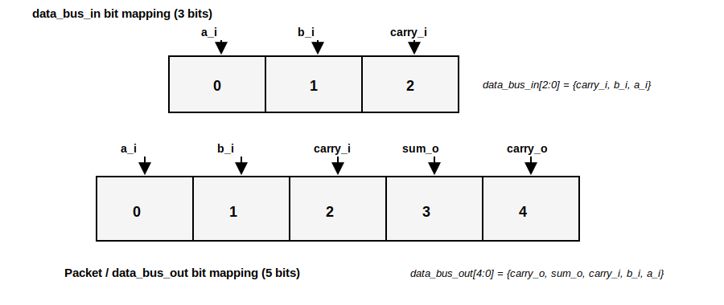

# Tutorial: Verifying a Full-Adder using SystemVerilog UVM

This tutorial verifies `full_adder.sv` using a SystemVerilog UVM testbench. The input space is 3 bits (a, b, carry_in), so the environment focuses on clear UVM structure plus coverage-driven stimulus to reach 100% for the input cross.

## File Structure
```bash
ip-cores-sv/FullAdder/
├── full_adder.sv
├── half_adder.sv
├── full_adder_wrapper.sv
├── dut_if.sv
├── full_adder_pkg.sv
├── pkt.sv
├── my_sequence.sv
├── my_sequencer.sv
├── my_driver.sv
├── my_monitor.sv
├── my_agent.sv
├── my_coverage.sv
├── my_scoreboard.sv
├── my_env.sv
├── my_test.sv
├── tb_top.sv
├── run.f
└── Makefile
```

## The DUT
The Full-Adder computes:
- `sum_o = a_i ^ b_i ^ carry_i`
- `carry_o = (a_i & b_i) | (a_i & carry_i) | (b_i & carry_i)`

It builds upon the Half-Adder to handle a third input: the carry-in from a previous stage.


To see more details about the RTL design of this module, check the [FullAdder RTL Design](https://github.com/UVMUFSC/IP-Cores/tree/main/ip-cores/full-adder).

## Verification Logic
- `tb_top`: instantiates the interface and wrapper, drives clock/reset, places `vif` into `uvm_config_db`, and calls `run_test`.
- `full_adder_pkg`: central include point for all UVM classes and macros.
- `my_env`: creates `my_agent`, `my_scoreboard`, and `my_coverage` and connects analysis ports.
- `my_agent`: encapsulates `my_sequencer`, `my_driver`, and `my_monitor`.
- `my_driver`: drives stimulus on the interface and asserts `valid_in`.
- `my_monitor`: samples outputs when `valid_out` is asserted and publishes `pkt` transactions.
- `my_scoreboard`: compares observed outputs with expected Full Adder equations.

## Packet / Sequence Item (`pkt`)
The `pkt` class is the sequence item used across the environment. It is also the core part that changes the most from one verification to another.
- `a_i`, `b_i`, and `carry_i` are randomized inputs.
- `sum_o` and `carry_o` are observed outputs captured by the monitor.
- The item maps to a 5-bit interface bus: one bit each for `a_i`, `b_i`, `carry_i`, `sum_o`, and `carry_o`.



### Packet (actual implementation)
```sv
class pkt extends uvm_sequence_item

	rand bit a_i;  
	rand bit b_i; 
	rand bit carry_i;
	bit sum_o;
	bit carry_o;

	`uvm_object_utils_begin(pkt)
		`uvm_field_int (a_i, UVM_DEFAULT)
		`uvm_field_int (b_i, UVM_DEFAULT)
		`uvm_field_int (carry_i, UVM_DEFAULT)
		`uvm_field_int (sum_o, UVM_DEFAULT)
		`uvm_field_int (carry_o, UVM_DEFAULT)
	`uvm_object_utils_end

	function new(string name = "pkt");
			super.new(name);
			this.carry_o = '0;
			this.sum_o = '0;
	endfunction

endclass
```

## Interface and Buses (`dut_if`)
The interface provides a simple handshake and two data buses:
- `data_bus_in[2:0]`: the driver places `a_i`, `b_i`, and `carry_i` on `[0]`, `[1]`, and `[2]` respectively.
- `data_bus_out[4:0]`: the wrapper places `a_i`, `b_i`, `carry_i`, `sum_o`, and `carry_o` on `[0]`, `[1]`, `[2]`, `[3]`, and `[4]` respectively.
- `valid_in`: asserted by the driver to indicate valid inputs.
- `valid_out`: asserted by the wrapper when outputs are ready.

## Wrapper Behavior (`full_adder_wrapper`)
The wrapper connects the DUT to the interface and implements a small handshake pipeline:
- On reset it clears both buses and deasserts `valid_in`/`valid_out`.
- When `valid_in` is high, it loads DUT outputs into `data_bus_out` (including echoed inputs and Full Adder results) and raises `valid_out` for the monitor to sample.
- When `valid_in` is low, `valid_out` is deasserted to avoid re-sampling stale data.

## Coverage and Event Synchronization (`my_coverage` + `my_sequence`)
Coverage is used to stop stimulus once all input combinations are observed:
- `my_coverage` defines a covergroup with `a_i`, `b_i`, `carry_i`, and a cross `a_i x b_i x carry_i` (8 combinations).
- After sampling, it writes the current coverage percentage into `uvm_config_db` and triggers a global `uvm_event` named `cov_sampled`.
- `my_sequence` waits for this event after each transaction and reads `cov_status` to decide whether to keep generating new packets.

## Scoreboard (actual implementation)
```sv
class my_scoreboard extends uvm_scoreboard;
	`uvm_component_utils (my_scoreboard)

	uvm_analysis_imp #(pkt, my_scoreboard) ap_imp;
	int num_errors = 0;

	function new (string name = "my_scoreboard", uvm_component parent = null);
		super.new (name, parent);
	endfunction

	virtual function void build_phase (uvm_phase phase);
		super.build_phase (phase);
		ap_imp = new ("ap_imp", this);
	endfunction

	virtual function void write (pkt data);
    
		bit expected_sum; 
		bit expected_carry; 
        
		expected_sum   = data.a_i ^ data.b_i ^ data.carry_i;
		expected_carry = (data.a_i & data.b_i) |
		                 (data.a_i & data.carry_i) |
		                 (data.b_i & data.carry_i);

		if ((data.sum_o == expected_sum) && (data.carry_o == expected_carry)) begin
			`uvm_info ("SCOREBOARD", {$sformatf("PASS: A=%0d, B=%0d, CI=%0d -> SUM=%0d, CO=%0d", data.a_i, data.b_i, data.carry_i, data.sum_o, data.carry_o)}, UVM_LOW)
		end 
		else begin
			string msg = {"FAIL: A=", $sformatf("%0d", data.a_i), 
						  ", B=", $sformatf("%0d", data.b_i),
						  ", CI=", $sformatf("%0d", data.carry_i),
						  ". EXPECTED SUM=", $sformatf("%0d", expected_sum),
						  ", GOT SUM=", $sformatf("%0d", data.sum_o),
						  ", EXPECTED CO=", $sformatf("%0d", expected_carry),
						  ", GOT CO=", $sformatf("%0d", data.carry_o)};

			`uvm_error ("SCOREBOARD", msg)
			this.num_errors++; 
		end
	endfunction

	virtual function void check_phase (uvm_phase phase);
		super.check_phase(phase);
		if (this.num_errors > 0) begin
			`uvm_fatal ("FINAL_RESULT", {$sformatf("TEST FAILED: Scoreboard found %0d errors.", num_errors)})
		end 
		else begin
			`uvm_info ("FINAL_RESULT", "TEST PASS: All transactions were correct.", UVM_NONE)
		end
	endfunction

	virtual task run_phase (uvm_phase phase);
		super.run_phase(phase);
	endtask
endclass
```

## Coverage (actual implementation)
The covergroup samples the full input space and uses a global event to synchronize with the sequence. The event is triggered after every coverage sample so the sequence can decide whether to generate another item. The event synchronization can be seen in the `my_sequence` file.
The covergroup declares three bins for the Full Adder input signals and cross them, making sure every possible combination (8 total) is covered.

```sv
class my_coverage extends uvm_subscriber #(pkt);
  `uvm_component_utils(my_coverage)

  pkt tr;
  uvm_event cov_sampled_event;

  covergroup cg_adder;
	option.per_instance = 1;
	cp_a_i: coverpoint tr.a_i;
	cp_b_i: coverpoint tr.b_i;
	cp_carry_i: coverpoint tr.carry_i;
	cross_abc: cross cp_a_i, cp_b_i, cp_carry_i;
  endgroup

  function new(string name, uvm_component parent);
	super.new(name, parent);
	cg_adder = new();
	cg_adder.set_inst_name("full_adder_cov");
	cov_sampled_event = uvm_event_pool::get_global("cov_sampled");
  endfunction

  virtual function void write(pkt t);
	this.tr = t;
	cg_adder.sample();
	uvm_config_db#(real)::set(null, "*", "cov_status", cg_adder.get_inst_coverage());
	cov_sampled_event.trigger();
  endfunction
endclass
```

## Running the Verification
```bash
cd ip-cores-sv/FullAdder
make run
```

## Console Output

```console
UVM_INFO @ 0: reporter [RNTST] Running test my_test...
UVM_INFO @ 0: reporter [UVMTOP] UVM testbench topology:
--------------------------------------------------------------
Name                       Type                    Size  Value
--------------------------------------------------------------
uvm_test_top               my_test                 -     @2639
  env                      my_env                  -     @2698
    agent                  my_agent                -     @2729
      drv                  my_driver               -     @3517
        rsp_port           uvm_analysis_port       -     @3616
        seq_item_port      uvm_seq_item_pull_port  -     @3567
      mon                  my_monitor              -     @3596
        mon_analysis_port  uvm_analysis_port       -     @3699
      seqr                 my_sequencer            -     @2880
        rsp_export         uvm_analysis_export     -     @2938
        seq_item_export    uvm_seq_item_pull_imp   -     @3486
        arbitration_queue  array                   0     -    
        lock_queue         array                   0     -    
        num_last_reqs      integral                32    'd1  
        num_last_rsps      integral                32    'd1  
    coverage               my_coverage             -     @2789
      analysis_imp         uvm_analysis_imp        -     @2838
    scoreboard             my_scoreboard           -     @2759
      ap_imp               uvm_analysis_imp        -     @3772
--------------------------------------------------------------

UVM_INFO my_monitor.sv(43) @ 30: uvm_test_top.env.agent.mon [my_monitor] Monitored A=0, B=0, CI=0, SUM=0, CO=0
UVM_INFO my_scoreboard.sv(34) @ 30: uvm_test_top.env.scoreboard [SCOREBOARD] PASS: A=0, B=0, CI=0 -> SUM=0, CO=0
UVM_INFO my_sequence.sv(27) @ 30: uvm_test_top.env.agent.seqr@@seqnc [SEQ] Status: 40.62%
UVM_INFO my_monitor.sv(43) @ 70: uvm_test_top.env.agent.mon [my_monitor] Monitored A=0, B=0, CI=0, SUM=0, CO=0
UVM_INFO my_scoreboard.sv(34) @ 70: uvm_test_top.env.scoreboard [SCOREBOARD] PASS: A=0, B=0, CI=0 -> SUM=0, CO=0
.
.
.
.
UVM_INFO my_scoreboard.sv(34) @ 790: uvm_test_top.env.scoreboard [SCOREBOARD] PASS: A=1, B=1, CI=0 -> SUM=0, CO=1
UVM_INFO my_sequence.sv(27) @ 790: uvm_test_top.env.agent.seqr@@seqnc [SEQ] Status: 100.00%
UVM_INFO /usr/eda/cadence/xcelium2209/tools/methodology/UVM/CDNS-1.1d/sv/src/base/uvm_objection.svh(1268) @ 790: reporter [TEST_DONE] 'run' phase is ready to proceed to the 'extract' phase
UVM_INFO my_scoreboard.sv(57) @ 790: uvm_test_top.env.scoreboard [FINAL_RESULT] TEST PASS: All transactions were correct.

--- UVM Report catcher Summary ---


Number of demoted UVM_FATAL reports  :    0
Number of demoted UVM_ERROR reports  :    0
Number of demoted UVM_WARNING reports:    0
Number of caught UVM_FATAL reports   :    0
Number of caught UVM_ERROR reports   :    0
Number of caught UVM_WARNING reports :    0

--- UVM Report Summary ---

** Report counts by severity
UVM_INFO :   64
UVM_WARNING :    0
UVM_ERROR :    0
UVM_FATAL :    0
** Report counts by id
[FINAL_RESULT]     1
[RNTST]     1
[SCOREBOARD]    20
[SEQ]    20
[TEST_DONE]     1
[UVMTOP]     1
[my_monitor]    20
Simulation complete via $finish(1) at time 790 NS + 51
```

## Debugging Tips
- Increase verbosity with `+UVM_VERBOSITY=UVM_HIGH` to see more driver/monitor activity, or run with the `gui` flag to set verbosity through the program interface.
- Step through phases using SimVision and add breakpoints.

