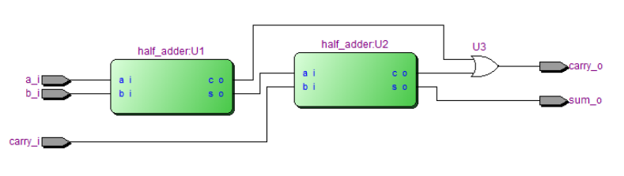
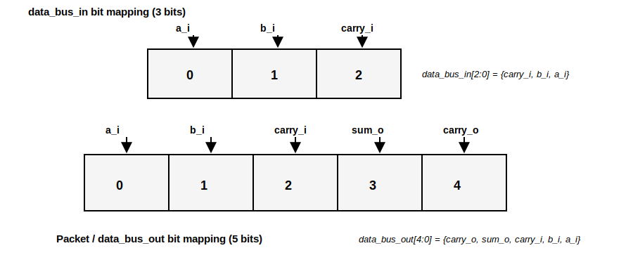

# Tutorial: Verifying a Full-Adder using SystemVerilog UVM

This tutorial verifies `rtl/full_adder.sv` using a SystemVerilog UVM testbench. The input space is 3 bits (`a_i`, `b_i`, `carry_i`), so the environment uses coverage-driven stimulus to reach full cross coverage.

## File Structure
```bash
ip-cores-sv/FullAdder/
├── README.md
├── rtl/
│   ├── half_adder.sv
│   └── full_adder.sv
├── tb/
│   ├── dut_if.sv
│   ├── full_adder_wrapper.sv
│   └── tb_top.sv
├── uvm/
│   ├── full_adder_pkg.sv
│   ├── pkt.sv
│   ├── fulladder_sequence.sv
│   ├── sequencer.sv
│   ├── driver.sv
│   ├── monitor.sv
│   ├── agent.sv
│   ├── coverage.sv
│   ├── scoreboard.sv
│   ├── env.sv
│   └── test.sv
└── sim/
    ├── run.f
    └── Makefile
```

## The DUT
The Full-Adder computes:
- `sum_o = a_i ^ b_i ^ carry_i`
- `carry_o = (a_i & b_i) | (a_i & carry_i) | (b_i & carry_i)`

It builds upon the Half-Adder to handle a third input: the carry-in from a previous stage.



To see more details about the RTL design of this module, check the [FullAdder RTL Design](https://github.com/UVMUFSC/IP-Cores/tree/main/ip-cores/full-adder).

## Verification Logic
- `tb_top`: instantiates interface and wrapper, drives clock/reset, places `vif` into `uvm_config_db`, and calls `run_test("test")`.
- `full_adder_pkg`: central include point for all UVM classes and macros.
- `env`: creates `agent`, `scoreboard`, and `coverage` and connects analysis ports.
- `agent`: encapsulates `sequencer`, `driver`, and `monitor`.
- `driver`: drives stimulus on the interface and asserts `valid_in`.
- `monitor`: samples outputs when `valid_out` is asserted and publishes `pkt` transactions.
- `scoreboard`: compares observed outputs with expected Full Adder equations.

## Packet / Sequence Item (`pkt`)
The `pkt` class is the sequence item used across the environment:
- `a_i`, `b_i`, and `carry_i` are randomized inputs.
- `sum_o` and `carry_o` are observed outputs captured by the monitor.
- The item maps to a 5-bit observation bus: `[0]=a_i`, `[1]=b_i`, `[2]=carry_i`, `[3]=sum_o`, `[4]=carry_o`.



### Packet (actual implementation)
```sv
class pkt extends uvm_sequence_item;

  // Randomized stimulus inputs.
  rand bit a_i;
  rand bit b_i;
  rand bit carry_i;
  // Observed outputs.
  bit sum_o;
  bit carry_o;

  `uvm_object_utils_begin(pkt)
    `uvm_field_int (a_i, UVM_DEFAULT)
    `uvm_field_int (b_i, UVM_DEFAULT)
    `uvm_field_int (carry_i, UVM_DEFAULT)
    `uvm_field_int (sum_o, UVM_DEFAULT)
    `uvm_field_int (carry_o, UVM_DEFAULT)
  `uvm_object_utils_end

  function new(string name = "pkt");
      super.new(name);
      this.carry_o = '0;
      this.sum_o = '0;
  endfunction

endclass
```

## Interface and Buses (`dut_if`)
The interface provides a simple handshake and two data buses:
- `data_bus_in[2:0]`: `[0]=a_i`, `[1]=b_i`, `[2]=carry_i`.
- `data_bus_out[4:0]`: `[0]=a_i`, `[1]=b_i`, `[2]=carry_i`, `[3]=sum_o`, `[4]=carry_o`.
- `valid_in`: asserted by the driver to indicate valid inputs.
- `valid_out`: asserted by the wrapper when outputs are ready.

## Coverage and Event Synchronization (`coverage` + `fulladder_sequence`)
Coverage is used to stop stimulus once all input combinations are observed:
- `coverage` defines a covergroup with `a_i`, `b_i`, `carry_i`, and a cross `a_i x b_i x carry_i` (8 combinations).
- After sampling, it writes the current coverage percentage into `uvm_config_db` and triggers a global `uvm_event` named `cov_sampled`.
- `fulladder_sequence` waits for this event after each transaction and reads `cov_status` to decide whether to keep generating new packets.

### Sequence (actual implementation)
```sv
class fulladder_sequence extends uvm_sequence #(pkt);
  `uvm_object_utils(fulladder_sequence)

  // Coverage state and synchronization event.
  real current_coverage = 0;
  uvm_event cov_sampled_event;

  function new (string name = "sequence");
    super.new(name);
    cov_sampled_event = uvm_event_pool::get_global("cov_sampled");
  endfunction

  // Generate packets until the coverage goal is achieved.
  virtual task body();
    pkt packet;
    while (current_coverage < 100.0) begin
      `uvm_do(packet);

       cov_sampled_event.wait_trigger();

      void'(uvm_config_db#(real)::get(null, "*", "cov_status", current_coverage));

      `uvm_info("SEQ", $sformatf("Status: %0.2f%%", current_coverage), UVM_LOW)
    end
  endtask
endclass
```

### Coverage (actual implementation)
```sv
class coverage extends uvm_subscriber #(pkt);
  `uvm_component_utils(coverage)

  // Last observed transaction and sync event.
  pkt tr;
  uvm_event cov_sampled_event;

  // Covergroup for Full Adder input space (a,b,carry_i).
  covergroup cg_adder;
  option.per_instance = 1; // per-instance coverage
  cp_a_i: coverpoint tr.a_i;
  cp_b_i: coverpoint tr.b_i;
  cp_carry_i: coverpoint tr.carry_i;
  cross_abc: cross cp_a_i, cp_b_i, cp_carry_i;
  endgroup

  // Constructor: build covergroup and get global event handle.
  function new(string name = "coverage", uvm_component parent);
  super.new(name, parent);
  cg_adder = new();
  cg_adder.set_inst_name("full_adder_cov");
  cov_sampled_event = uvm_event_pool::get_global("cov_sampled");
  endfunction

  // Sample coverage and publish current coverage percentage.
  virtual function void write(pkt t);
  this.tr = t;
  cg_adder.sample();
  uvm_config_db#(real)::set(null, "*", "cov_status", cg_adder.get_inst_coverage());
  cov_sampled_event.trigger();
  endfunction
endclass
```

### Scoreboard (actual implementation)
```sv
class scoreboard extends uvm_scoreboard;
  `uvm_component_utils (scoreboard)

  // Analysis implementation and error counter.
  uvm_analysis_imp #(pkt, scoreboard) ap_imp;
  int num_errors = 0;

  function new (string name = "scoreboard", uvm_component parent = null);
    super.new (name, parent);
  endfunction

  // Create analysis implementation port.
  virtual function void build_phase (uvm_phase phase);
    super.build_phase (phase);
    ap_imp = new ("ap_imp", this);
  endfunction

  // Compare expected vs observed outputs for each transaction.
  virtual function void write (pkt data);
    bit expected_sum;
    bit expected_carry;

    expected_sum   = data.a_i ^ data.b_i ^ data.carry_i;
    expected_carry = (data.a_i & data.b_i) |
             (data.a_i & data.carry_i) |
             (data.b_i & data.carry_i);

    if ((data.sum_o == expected_sum) && (data.carry_o == expected_carry)) begin
      `uvm_info ("SCOREBOARD", {$sformatf("PASS: A=%0d, B=%0d, CI=%0d -> SUM=%0d, CO=%0d", data.a_i, data.b_i, data.carry_i, data.sum_o, data.carry_o)}, UVM_LOW)
    end
    else begin
      string msg = {"FAIL: A=", $sformatf("%0d", data.a_i),
            ", B=", $sformatf("%0d", data.b_i),
            ", CI=", $sformatf("%0d", data.carry_i),
            ". EXPECTED SUM=", $sformatf("%0d", expected_sum),
            ", GOT SUM=", $sformatf("%0d", data.sum_o),
            ", EXPECTED CO=", $sformatf("%0d", expected_carry),
            ", GOT CO=", $sformatf("%0d", data.carry_o)};

      `uvm_error ("SCOREBOARD", msg)
      this.num_errors++;
    end
  endfunction

  // Report final test status based on error count.
  virtual function void check_phase (uvm_phase phase);
    super.check_phase(phase);
    if (this.num_errors > 0) begin
      `uvm_fatal ("FINAL_RESULT", {$sformatf("TEST FAILED: Scoreboard found %0d errors.", num_errors)})
    end
    else begin
      `uvm_info ("FINAL_RESULT", "TEST PASS: All transactions were correct.", UVM_NONE)
    end
  endfunction
endclass
```

## Running the Verification
```bash
cd ip-cores-sv/FullAdder/sim
make run
```

To run and save the console output to `simulation.log`:
```bash
make run_log
```

To change verbosity (in `sim/Makefile`):
```makefile
XRUN = xrun -64bit -uvm -sv
RUN_F = run.f
TEST = test
VERBOSITY = UVM_LOW
```

## Console Output (example)
```console
UVM_INFO @ 0: reporter [RNTST] Running test test...
UVM_INFO @ 0: reporter [UVMTOP] UVM testbench topology:
--------------------------------------------------------------
Name                       Type                    Size  Value
--------------------------------------------------------------
uvm_test_top               test                    -     @2640
  env                      env                     -     @2699
    agent                  agent                   -     @2730
      driver               driver                  -     @3518
        rsp_port           uvm_analysis_port       -     @3617
        seq_item_port      uvm_seq_item_pull_port  -     @3568
      monitor              monitor                 -     @3597
        mon_analysis_port  uvm_analysis_port       -     @3700
      sequencer            sequencer               -     @2881
        rsp_export         uvm_analysis_export     -     @2939
        seq_item_export    uvm_seq_item_pull_imp   -     @3487
        arbitration_queue  array                   0     -    
        lock_queue         array                   0     -    
        num_last_reqs      integral                32    'd1  
        num_last_rsps      integral                32    'd1  
    coverage               coverage                -     @2790
      analysis_imp         uvm_analysis_imp        -     @2839
    scoreboard             scoreboard              -     @2760
      ap_imp               uvm_analysis_imp        -     @3773
--------------------------------------------------------------

UVM_INFO /home/100000001332321/Documents/UVM_UFSC/FullAdder/uvm/monitor.sv(43) @ 30: uvm_test_top.env.agent.monitor [monitor] Monitored A=0, B=0, CI=0, SUM=0, CO=0
UVM_INFO /home/100000001332321/Documents/UVM_UFSC/FullAdder/uvm/scoreboard.sv(34) @ 30: uvm_test_top.env.scoreboard [SCOREBOARD] PASS: A=0, B=0, CI=0 -> SUM=0, CO=0
UVM_INFO /home/100000001332321/Documents/UVM_UFSC/FullAdder/uvm/fulladder_sequence.sv(27) @ 30: uvm_test_top.env.agent.sequencer@@sequence [SEQ] Status: 40.62%
.
.
.
UVM_INFO /home/100000001332321/Documents/UVM_UFSC/FullAdder/uvm/fulladder_sequence.sv(27) @ 2270: uvm_test_top.env.agent.sequencer@@sequence [SEQ] Status: 100.00%
UVM_INFO /usr/eda/cadence/xcelium2209/tools/methodology/UVM/CDNS-1.1d/sv/src/base/uvm_objection.svh(1268) @ 2270: reporter [TEST_DONE] 'run' phase is ready to proceed to the 'extract' phase
UVM_INFO /home/100000001332321/Documents/UVM_UFSC/FullAdder/uvm/scoreboard.sv(57) @ 2270: uvm_test_top.env.scoreboard [FINAL_RESULT] TEST PASS: All transactions were correct.

--- UVM Report catcher Summary ---


Number of demoted UVM_FATAL reports  :    0
Number of demoted UVM_ERROR reports  :    0
Number of demoted UVM_WARNING reports:    0
Number of caught UVM_FATAL reports   :    0
Number of caught UVM_ERROR reports   :    0
Number of caught UVM_WARNING reports :    0

--- UVM Report Summary ---

** Report counts by severity
UVM_INFO :  175
UVM_WARNING :    0
UVM_ERROR :    0
UVM_FATAL :    0
** Report counts by id
[FINAL_RESULT]     1
[RNTST]     1
[SCOREBOARD]    57
[SEQ]    57
[TEST_DONE]     1
[UVMTOP]     1
[monitor]    57
Simulation complete via $finish(1) at time 2270 NS + 51
```

## What is New in This Version
- Testbench sources were reorganized into `rtl/`, `tb/`, `uvm/`, and `sim/` folders.
- UVM class/file naming was simplified (`my_*` names replaced by `agent`, `env`, `test`, `coverage`, `scoreboard`, `driver`, `monitor`, `sequencer`, and `fulladder_sequence`).
- `tb_top` now calls `run_test("test")`.
- `sim/Makefile` now uses `TEST = test`, supports configurable `VERBOSITY`, and provides `run_log`.
- `sim/run.f` now references files using the new folder structure.
