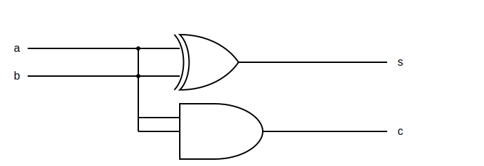
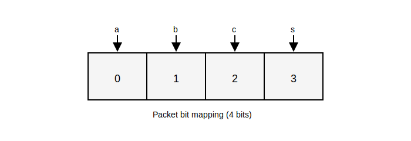

# Tutorial: Verifying a Half-Adder using SystemVerilog UVM

This tutorial verifies `half_adder.sv` using a SystemVerilog UVM testbench. The input space is only 2 bits, so the environment focuses on clear UVM structure plus coverage-driven stimulus to reach 100% for the input cross.

## File Structure
```bash
ip-cores-sv/HalfAdder/
├── half_adder.sv
├── half_adder_wrapper.sv
├── dut_if.sv
├── half_adder_pkg.sv
├── pkt.sv
├── my_sequence.sv
├── my_sequencer.sv
├── my_driver.sv
├── my_monitor.sv
├── my_agent.sv
├── my_coverage.sv
├── my_scoreboard.sv
├── my_env.sv
├── my_test.sv
├── tb_top.sv
├── run.f
└── Makefile
```

## The DUT
The Half-Adder computes `s = a ^ b` and `c = a & b`.



To see more details about the RTL design of this module, check the [HalfAdder RTL Design](https://github.com/UVMUFSC/IP-Cores/tree/main/ip-cores/half-adder).

## Verification Logic
- `tb_top`: instantiates the interface and wrapper, drives clock/reset, places `vif` into `uvm_config_db`, and calls `run_test`.
- `half_adder_pkg`: central include point for all UVM classes and macros.
- `my_env`: creates `my_agent`, `my_scoreboard`, and `my_coverage` and connects analysis ports.
- `my_agent`: encapsulates `my_sequencer`, `my_driver`, and `my_monitor`.
- `my_driver`: drives stimulus on the interface and asserts `valid_in`.
- `my_monitor`: samples outputs when `valid_out` is asserted and publishes `pkt` transactions.
- `my_scoreboard`: compares observed outputs with expected `a ^ b` and `a & b` values.

## Packet / Sequence Item (`pkt`)
The `pkt` class is the sequence item used across the environment. It is also the core part that changes the most from one verification to another.
- `a` and `b` are randomized inputs.
- `s` and `c` are observed outputs captured by the monitor.
- The item is 4 bits wide in total when mapped on the interface bus: one bit each for `a`, `b`, `c`, and `s`.



### Packet (actual implementation)
```sv
class pkt extends uvm_sequence_item

	rand bit a;  
	rand bit b; 
	bit s;
	bit c;

	`uvm_object_utils_begin(pkt)
		`uvm_field_int (a, UVM_DEFAULT)
		`uvm_field_int (b, UVM_DEFAULT)
		`uvm_field_int (s, UVM_DEFAULT)
		`uvm_field_int (c, UVM_DEFAULT)
	`uvm_object_utils_end

	function new(string name = "pkt");
			super.new(name);
			this.c = '0;
			this.s = '0;
	endfunction

endclass
```

## Interface and Buses (`dut_if`)
The interface provides a simple handshake and two 4-bit buses:
- `data_bus_in[3:0]`: the driver places `a` and `b` on `[0]` and `[1]` (upper bits are unused).
- `data_bus_out[3:0]`: the wrapper places `a`, `b`, `c`, and `s` on `[0]`, `[1]`, `[2]`, and `[3]` respectively.
- `valid_in`: asserted by the driver to indicate valid inputs.
- `valid_out`: asserted by the wrapper when outputs are ready.

## Wrapper Behavior (`half_adder_wrapper`)
The wrapper connects the DUT to the interface and implements a small handshake pipeline:
- On reset it clears both buses and deasserts `valid_in`/`valid_out`.
- When `valid_in` is high, it loads DUT outputs into `data_bus_out` and raises `valid_out` for the monitor to sample.
- When `valid_in` is low, `valid_out` is deasserted to avoid re-sampling stale data.

## Coverage and Event Synchronization (`my_coverage` + `my_sequence`)
Coverage is used to stop stimulus once all input combinations are observed:
- `my_coverage` defines a covergroup with `a`, `b`, and a cross `a x b`.
- After sampling, it writes the current coverage percentage into `uvm_config_db` and triggers a global `uvm_event` named `cov_sampled`.
- `my_sequence` waits for this event after each transaction and reads `cov_status` to decide whether to keep generating new packets.

## Scoreboard (actual implementation)
```sv
class my_scoreboard extends uvm_scoreboard;
	`uvm_component_utils (my_scoreboard)

	uvm_analysis_imp #(pkt, my_scoreboard) ap_imp;
	int num_errors = 0;

	function new (string name = "my_scoreboard", uvm_component parent = null);
		super.new (name, parent);
	endfunction

	virtual function void build_phase (uvm_phase phase);
		super.build_phase (phase);
		ap_imp = new ("ap_imp", this);
	endfunction

	virtual function void write (pkt data);
    
		bit expected_s; 
		bit expected_c; 
        
		expected_s = data.a ^ data.b; 
		expected_c = data.a & data.b; 

		if (data.s == expected_s && data.c == expected_c) begin
			`uvm_info ("SCOREBOARD", {$sformatf("PASS: A=%0d, B=%0d -> S=%0d, C=%0d", data.a, data.b, data.s, data.c)}, UVM_LOW)
		end 
		else begin
			string msg = {"FAIL: A=", $sformatf("%0d", data.a), 
						  ", B=", $sformatf("%0d", data.b), 
						  ". EXPECTED S=", $sformatf("%0d", expected_s), 
						  ", RECEIVED S=", $sformatf("%0d", data.s)};

			`uvm_error ("SCOREBOARD", msg)
			this.num_errors++; 
		end
	endfunction

	virtual function void check_phase (uvm_phase phase);
		super.check_phase(phase);
		if (this.num_errors > 0) begin
			`uvm_fatal ("FINAL_RESULT", {$sformatf("TEST FAILED: Scoreboard found %0d errors.", num_errors)})
		end 
		else begin
			`uvm_info ("FINAL_RESULT", "TEST PASS: All transactions were correct.", UVM_NONE)
		end
	endfunction

	virtual task run_phase (uvm_phase phase);
		super.run_phase(phase);
	endtask
endclass
```

## Coverage (actual implementation)
The covergroup samples the full input space and uses a global event to synchronize with the sequence. The event is triggered after every coverage sample so the sequence can decide whether to generate another item. The event synchronization can be seen in the `my_sequence` file.
The covergroup declares two bins for the `DUT` signals and cross them, making sure every possible combination is covered.

```sv
class my_coverage extends uvm_subscriber #(pkt);
  `uvm_component_utils(my_coverage)

  pkt tr;
  uvm_event cov_sampled_event;

  covergroup cg_adder;
	option.per_instance = 1;
	cp_a: coverpoint tr.a;
	cp_b: coverpoint tr.b;
	cross_ab: cross cp_a, cp_b;
  endgroup

  function new(string name, uvm_component parent);
	super.new(name, parent);
	cg_adder = new();
	cg_adder.set_inst_name("half_adder_cov");
	cov_sampled_event = uvm_event_pool::get_global("cov_sampled");
  endfunction

  virtual function void write(pkt t);
	this.tr = t;
	cg_adder.sample();
	uvm_config_db#(real)::set(null, "*", "cov_status", cg_adder.get_inst_coverage());
	cov_sampled_event.trigger();
  endfunction
endclass
```

## Running the Verification
```bash
cd ip-cores-sv/HalfAdder
make
```

## Console Output

```console
UVM_INFO @ 0: reporter [RNTST] Running test my_test...
UVM_INFO @ 0: reporter [UVMTOP] UVM testbench topology:
--------------------------------------------------------------
Name                       Type                    Size  Value
--------------------------------------------------------------
uvm_test_top               my_test                 -     @2638
  env                      my_env                  -     @2697
    agent                  my_agent                -     @2728
      drv                  my_driver               -     @3516
        rsp_port           uvm_analysis_port       -     @3615
        seq_item_port      uvm_seq_item_pull_port  -     @3566
      mon                  my_monitor              -     @3595
        mon_analysis_port  uvm_analysis_port       -     @3698
      seqr                 my_sequencer            -     @2879
        rsp_export         uvm_analysis_export     -     @2937
        seq_item_export    uvm_seq_item_pull_imp   -     @3485
        arbitration_queue  array                   0     -    
        lock_queue         array                   0     -    
        num_last_reqs      integral                32    'd1  
        num_last_rsps      integral                32    'd1  
    coverage               my_coverage             -     @2788
      analysis_imp         uvm_analysis_imp        -     @2837
    scoreboard             my_scoreboard           -     @2758
      ap_imp               uvm_analysis_imp        -     @3771
--------------------------------------------------------------

UVM_INFO my_monitor.sv(42) @ 30: uvm_test_top.env.agent.mon [my_monitor] Monitored A=0, B=0
UVM_INFO my_scoreboard.sv(32) @ 30: uvm_test_top.env.scoreboard [SCOREBOARD] PASS: A=0, B=0 -> S=0, C=0
UVM_INFO my_sequence.sv(21) @ 30: uvm_test_top.env.agent.seqr@@seqnc [SEQ] Status: 41.67%
UVM_INFO my_monitor.sv(42) @ 70: uvm_test_top.env.agent.mon [my_monitor] Monitored A=0, B=0
UVM_INFO my_scoreboard.sv(32) @ 70: uvm_test_top.env.scoreboard [SCOREBOARD] PASS: A=0, B=0 -> S=0, C=0
UVM_INFO my_sequence.sv(21) @ 70: uvm_test_top.env.agent.seqr@@seqnc [SEQ] Status: 41.67%
UVM_INFO my_monitor.sv(42) @ 110: uvm_test_top.env.agent.mon [my_monitor] Monitored A=0, B=0
UVM_INFO my_scoreboard.sv(32) @ 110: uvm_test_top.env.scoreboard [SCOREBOARD] PASS: A=0, B=0 -> S=0, C=0
UVM_INFO my_sequence.sv(21) @ 110: uvm_test_top.env.agent.seqr@@seqnc [SEQ] Status: 41.67%
UVM_INFO my_monitor.sv(42) @ 150: uvm_test_top.env.agent.mon [my_monitor] Monitored A=0, B=0
UVM_INFO my_scoreboard.sv(32) @ 150: uvm_test_top.env.scoreboard [SCOREBOARD] PASS: A=0, B=0 -> S=0, C=0
UVM_INFO my_sequence.sv(21) @ 150: uvm_test_top.env.agent.seqr@@seqnc [SEQ] Status: 41.67%
UVM_INFO my_monitor.sv(42) @ 190: uvm_test_top.env.agent.mon [my_monitor] Monitored A=0, B=0
UVM_INFO my_scoreboard.sv(32) @ 190: uvm_test_top.env.scoreboard [SCOREBOARD] PASS: A=0, B=0 -> S=0, C=0
UVM_INFO my_sequence.sv(21) @ 190: uvm_test_top.env.agent.seqr@@seqnc [SEQ] Status: 41.67%
UVM_INFO my_monitor.sv(42) @ 230: uvm_test_top.env.agent.mon [my_monitor] Monitored A=1, B=0
UVM_INFO my_scoreboard.sv(32) @ 230: uvm_test_top.env.scoreboard [SCOREBOARD] PASS: A=1, B=0 -> S=1, C=0
UVM_INFO my_sequence.sv(21) @ 230: uvm_test_top.env.agent.seqr@@seqnc [SEQ] Status: 66.67%
UVM_INFO my_monitor.sv(42) @ 270: uvm_test_top.env.agent.mon [my_monitor] Monitored A=1, B=0
UVM_INFO my_scoreboard.sv(32) @ 270: uvm_test_top.env.scoreboard [SCOREBOARD] PASS: A=1, B=0 -> S=1, C=0
UVM_INFO my_sequence.sv(21) @ 270: uvm_test_top.env.agent.seqr@@seqnc [SEQ] Status: 66.67%
UVM_INFO my_monitor.sv(42) @ 310: uvm_test_top.env.agent.mon [my_monitor] Monitored A=1, B=0
UVM_INFO my_scoreboard.sv(32) @ 310: uvm_test_top.env.scoreboard [SCOREBOARD] PASS: A=1, B=0 -> S=1, C=0
UVM_INFO my_sequence.sv(21) @ 310: uvm_test_top.env.agent.seqr@@seqnc [SEQ] Status: 66.67%
UVM_INFO my_monitor.sv(42) @ 350: uvm_test_top.env.agent.mon [my_monitor] Monitored A=0, B=0
UVM_INFO my_scoreboard.sv(32) @ 350: uvm_test_top.env.scoreboard [SCOREBOARD] PASS: A=0, B=0 -> S=0, C=0
UVM_INFO my_sequence.sv(21) @ 350: uvm_test_top.env.agent.seqr@@seqnc [SEQ] Status: 66.67%
UVM_INFO my_monitor.sv(42) @ 390: uvm_test_top.env.agent.mon [my_monitor] Monitored A=0, B=1
UVM_INFO my_scoreboard.sv(32) @ 390: uvm_test_top.env.scoreboard [SCOREBOARD] PASS: A=0, B=1 -> S=1, C=0
UVM_INFO my_sequence.sv(21) @ 390: uvm_test_top.env.agent.seqr@@seqnc [SEQ] Status: 91.67%
UVM_INFO my_monitor.sv(42) @ 430: uvm_test_top.env.agent.mon [my_monitor] Monitored A=1, B=1
UVM_INFO my_scoreboard.sv(32) @ 430: uvm_test_top.env.scoreboard [SCOREBOARD] PASS: A=1, B=1 -> S=0, C=1
UVM_INFO my_sequence.sv(21) @ 430: uvm_test_top.env.agent.seqr@@seqnc [SEQ] Status: 100.00%
UVM_INFO /usr/eda/cadence/xcelium2209/tools/methodology/UVM/CDNS-1.1d/sv/src/base/uvm_objection.svh(1268) @ 430: reporter [TEST_DONE] 'run' phase is ready to proceed to the 'extract' phase
UVM_INFO my_scoreboard.sv(52) @ 430: uvm_test_top.env.scoreboard [FINAL_RESULT] TEST PASS: All transactions were correct.

--- UVM Report catcher Summary ---


Number of demoted UVM_FATAL reports  :    0
Number of demoted UVM_ERROR reports  :    0
Number of demoted UVM_WARNING reports:    0
Number of caught UVM_FATAL reports   :    0
Number of caught UVM_ERROR reports   :    0
Number of caught UVM_WARNING reports :    0

--- UVM Report Summary ---

** Report counts by severity
UVM_INFO :   37
UVM_WARNING :    0
UVM_ERROR :    0
UVM_FATAL :    0
** Report counts by id
[FINAL_RESULT]     1
[RNTST]     1
[SCOREBOARD]    11
[SEQ]    11
[TEST_DONE]     1
[UVMTOP]     1
[my_monitor]    11
Simulation complete via $finish(1) at time 430 NS + 51
/usr/eda/cadence/xcelium2209/tools/methodology/UVM/CDNS-1.1d/sv/src/base/uvm_root.svh:457     $finish;
xcelium> exit
xmsim: *N,COVCGN: Coverage configuration file command "set_covergroup -new_instance_reporting" can be specified to improve the scoping and naming of covergroup instances. It may be noted that subsequent merging of a coverage database saved with this command and a coverage database saved without this command is not allowed.

coverage setup:
  workdir  :  ./cov_work
  dutinst  :  tb_top(tb_top)
  scope    :  scope
  testname :  test

coverage files:
  model(design data) :  ./cov_work/scope/icc_73b0c807_6f2bc0f1.ucm
  data               :  ./cov_work/scope/test/icc_73b0c807_6f2bc0f1.ucd

```

## Debugging Tips
- Increase verbosity with `+UVM_VERBOSITY=UVM_HIGH` to see more driver/monitor activity, or run with the `gui` flag to set verbosity through the program interface.
- Step through phases using SimVision and add breakpoints.

## Discussion and Improvements
Even though the verification works, there are structural details worth revisiting:
- Evaluate whether the interface really needs two separate buses (`data_bus_in` and `data_bus_out`). A single bus with direction control could be enough for this DUT.
- If keeping two buses, consider shrinking `data_bus_in` to 2 bits because `s` and `c` are never driven on that bus.
- Maybe increase modularity by separating the covergroup from the coverage module.
