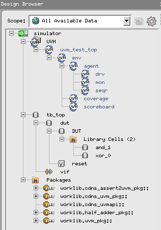
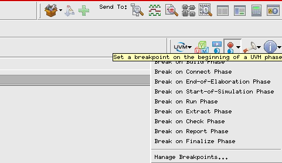
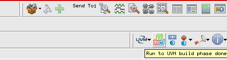
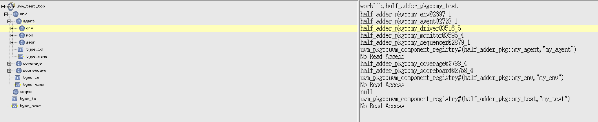
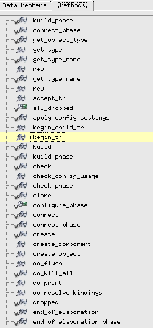
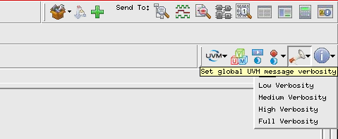

# SystemVerilog UVM Verification Tutorials Collection

This directory contains **SystemVerilog UVM** verification tutorials. Each tutorial verifies a specific Verilog/SystemVerilog module using a consistent UVM architecture (sequencer → driver → monitor → scoreboard) and coverage-driven testing.

## 📁 Project Structure

```
ip-cores-sv/
│
├── HalfAdder/         # Half-Adder UVM tutorial
├── FullAdder/         # Full-Adder UVM tutorial
├── Adder4Bits/        # 4-bit Adder UVM tutorial
├── Demux/             # 1x4 Demultiplexer UVM tutorial
├── Mux/               # 4x1 Multiplexer UVM tutorial
├── Mealy/             # Mealy state-machine tutorial
└── Moore/             # Moore state-machine tutorial
```

## 🎯 Tutorial Overview

Each tutorial follows a consistent UVM style and typically includes:

- Design Under Test (DUT) — SystemVerilog/Verilog module
- UVM testbench components: `my_test`, `my_env`, `my_agent`, `my_driver`, `my_sequencer`, `my_monitor`, `my_scoreboard`, and `my_coverage`
- Transaction item (`pkt`) and sequence (`my_sequence`) for randomized stimulus
- Virtual interface (e.g., `dut_if`) for DUT connectivity
- DUT wrapper (when needed) to align DUT signals with the interface
- `run.f` filelist and `Makefile` for Xcelium execution

## 🏗️ UVM Architecture

Each SystemVerilog tutorial implements a standard UVM hierarchy.<br>
The diagram below uses nested boxes to emphasize hierarchy (my_test > my_env > Agent), and places the virtual interface + DUT to the right of the Agent.

```
+----------------------------------------------------------------------------------+
|                                  my_test                                         |
|                                                                                  |
|  +------------------------------------------+                                    |
|  |                  my_env                  |                                    |
|  |  +-----------------------------------+   |                                    |
|  |  |         Agent                     |   |                                    |
|  |  |  +-------------+    +---------+   |   |         +---------------+          |
|  |  |  | my_sequencer|--->|my_driver|---+---+----+--->|virtual dut_if |          |
|  |  |  +-----^-------+    +----+----+   |   |    |    +-------+-------+          |
|  |  |        |                          |   |    |            |                  |
|  |  |        |                          |   |    |            |                  |
|  |  |        |                          |   |    |            |                  |
|  |  |  +-----+-----+    +------v-----+  |   |    |            |                  |
|  |  |  |my_sequence|    | my_monitor |<-+--------+            |                  |
|  |  |  |  (pkt)    |    +------^-----+  |   |       +---------v----------+       |
|  |  |  +-----------+        |           |   |       |    DUT wrapper     |       |
|  |  +-----------------------|-----------+   |       |  +--------------+  |       |
|  |   +----------------+     |               |       |  |     DUT      |  |       |
|  |   |   Scoreboard  |<----+                |       |  +--------------+  |       |
|  |   +----------------+     |               |       |                    |       |
|  |   +----------------+     |               |       +--------------------+       |
|  |   |    Coverage   |<----+                |                                    |
|  |   +----------------+                     |                                    |
|  +------------------------------------------+                                    |
+----------------------------------------------------------------------------------+
```
To see more about the UVM library, architecture and phases check [UVM Tutorial](../../Readme.md).

## 🛠️ Prerequisites

- SystemVerilog compiler (Xcelium, VCS, or similar)
- IEEE UVM library (typically included with simulator)
- GNU Make

## 🚀 Quick Start

1. Choose a tutorial (e.g., `HalfAdder`):

```bash
cd ip-cores-sv/HalfAdder
```

2. Run the simulation using make:

```bash
make run
```

3. (Optional) Open with SimVision GUI for waveform inspection:

```bash
make gui
```

4. Check test results in the console output or coverage files.

## 🛠️ Example Makefile

Most tutorials include a Makefile similar to this example (Xcelium flow):

```makefile
# Simple Makefile for UVM + Xcelium
XRUN = xrun -64bit -uvm -sv
RUN_F = run.f
TEST = my_test

# Main target: compile and run
run: clean
	$(XRUN) -f $(RUN_F) -coverage all -covoverwrite +UVM_TESTNAME=$(TEST)

# Clean generated simulation artifacts
clean:
	rm -rf xcelium.d xrun.history xrun.log waves.shm cov_work

# Open with SimVision
gui: 
	$(XRUN) -f $(RUN_F) -coverage all -covoverwrite +UVM_TESTNAME=$(TEST) -gui
```

## Using SimVision
If you choose to run the simulation using the `gui` flag, the SimVision interface will open, offering a lot of features that can be interesting when debugging the simulation. Not every feature has been studied and used in our simulation, so there may be more of it to be explored.

- **UVM Hierarchy Tree**:

  

- **Breakpoints**:

  

- **Step Through Phases**:

  

- **Class Details**:

  

  Here it's possible to see where some components are located (memory).

  

  Every class method can be seen here.

- **Set Verbosity Level (Debugging)**:

  

## 🧪 Typical UVM Test Flow

1. RTL and testbench files are compiled (from `run.f`).
2. `build_phase()` creates the UVM components (`my_env`, `my_agent`, etc.).
3. `connect_phase()` links TLM/analysis ports (monitor → scoreboard/coverage) and driver ↔ sequencer.
4. `run_phase()` starts the main sequence and drives randomized stimulus.
5. The monitor publishes transactions; the scoreboard checks results and coverage updates the goal status.
6. When coverage goals are met and objections are dropped, the test ends.

## 🧾 Debugging Tips

- Use `uvm_top.print_topology()` to confirm hierarchy.
- Check `uvm_info` and `uvm_error` logs for data mismatches and configuration issues.
- If `uvm_config_db::get()` fails, confirm the key, scope, and timing of the `set()` call.
- For waveform/debugging, run with `-gui` and inspect signals in SimVision.

## 🤝 Contributing

Contributions are welcome: bug fixes, new tutorials, improved coverage models, or documentation updates.

## 📝 License

This project is intended for educational purposes. See individual tutorial files for additional licensing notes.

Happy Verifying! 🎉

