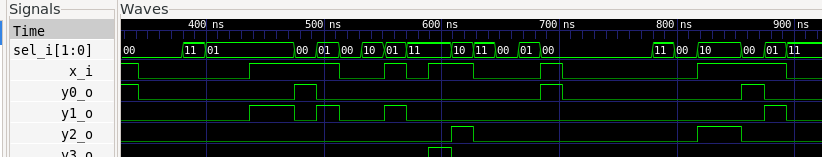

# Tutorial: Verifying a 1x4 Demultiplexer using UVM.

This tutorial is a practical guide focused on verifying a Verilog *1x4 demultiplexer* module. It assumes you have already read the main `README.md` and understand the verification architecture (Driver, Monitor, Scoreboard) we are using.

Our goal here is to detail:
1.  The Verilog module we are testing (DUT).
2.  The specific verification logic for the *1x4 demultiplexer*.
3.  How to run the simulation and interpret the results.

## Prerequisites

To follow this tutorial, you will need:
* A Verilog simulator (e.g., Icarus Verilog).
* Python 3.6+.
* Cocotb (`pip install cocotb`).
* GTKWave (optional, for waveform viewing).

## File Structure

We assume the following file structure for the project:
```bash
/project-demux-1x4
│
├── demux1x4.v          # Design Under Test 
├── uvm_demux.py        # UVM testbench 
├── Makefile            
└── dump.fst            # (Generated after simulation) Waveform file
```

## 1. The DUT (Design Under Test): `demux1x4.v`

The *1x4 demultiplexer* is a combinational circuit that takes one input signal (`x_in`) and a 2-bit selector (`sel`) and routes the input to one of four outputs (`y_out[3:0]`). 

Our goal is to prove that our [1x4 demultiplexer](https://github.com/UVMUFSC/IP-Cores/tree/main/ip-cores/demux-1x4) verilog implementation is correct. 

# 2. The Verification Logic: `uvm_demux.py`

Although our testbench has several components (Driver, Monitor), the "intelligence" of the 1x4 demultiplexer verification is concentrated in two places:

---

## a) The Reference Model (Scoreboard)

The **Scoreboard** needs to know what the correct result is for any given input.  
We do this by implementing the same routing logic as the demultiplexer, but in **Python**.  
This is our *golden model*.

Look at the `ref_model` function inside the `Scoreboard` class:

```python
# 4. Scoreboard
class Scoreboard:
    # ... (other functions) ...
    def ref_model(self, tr: DemuxTransaction):
        # This is the 'golden model' logic in Python
        y_expected = [0, 0, 0, 0]
        if 0 <= tr.sel <= 3:
            y_expected[tr.sel] = tr.x_in
        
        # Store the expected result for future comparison
        self.expected_queue.append({
            "inputs": (tr.x_in, tr.sel),
            "outputs": tuple(y_expected)
        })
```
## b) The Test Sequence (Test)
Since the 1x4 demultiplexer has 1 input bit and 2 selector bits, we use random testing to achieve good coverage across all possible combinations.

This is defined in the demux_random_test function:

```python
# 6. Test
@cocotb.test()
async def demux_random_test(dut):
    env = Environment(dut)

    # 1. We perform random testing for comprehensive coverage
    for _ in range(50):
        x_in = random.randint(0, 1)
        sel = random.randint(0, 3)
        tr = DemuxTransaction(x_in=x_in, sel=sel)
        
        # 2. Tell the Scoreboard what to expect
        env.scoreboard.ref_model(tr)
        
        # 3. Send the inputs to the DUT
        await env.driver.drive(tr)
        
        # 4. Capture the DUT outputs (and trigger the Scoreboard)
        await env.monitor.run()

    # 5. Check if any errors were found
    assert env.scoreboard.errors == 0
```


The test uses random inputs to ensure all possible routing scenarios are tested.

# 3. Running the Verification

To run the simulation, we need a Makefile that tells Cocotb which files to use.

##  Makefile

```makefile
SIM ?= icarus
TOPLEVEL_LANG ?= verilog

VERILOG_SOURCES += demux1x4.v

COCOTB_TEST_MODULES = uvm_demux

TOPLEVEL = demux1x4

include $(shell cocotb-config --makefiles)/Makefile.sim
```

With this file in the folder, just run in the terminal:
```bash
make SIM=icarus WAVES=1
```

This will compile the Verilog, start the simulator, and run the Python testbench. 
```bash
WAVES=1
```
It will be responsible for generating the waveform files in `.fst` format.

# 4. Analyzing the Results

After running `make`, we analyze two artifacts:

## a) Console Output
The console shows the Scoreboard log in real-time. Each [SCOREBOARD PASS] line tells us that, for a given pair of inputs, the DUT's output matched our reference model's output.
```console
[SCOREBOARD PASS] Entradas x_in=0, sel=2 -> y_out=(Logic('0'), Logic('0'), Logic('0'), Logic('0'))
[SCOREBOARD PASS] Entradas x_in=1, sel=1 -> y_out=(Logic('0'), Logic('1'), Logic('0'), Logic('0'))
[SCOREBOARD PASS] Entradas x_in=1, sel=0 -> y_out=(Logic('1'), Logic('0'), Logic('0'), Logic('0'))
[SCOREBOARD PASS] Entradas x_in=0, sel=3 -> y_out=(Logic('0'), Logic('0'), Logic('0'), Logic('0'))
[SCOREBOARD PASS] Entradas x_in=1, sel=2 -> y_out=(Logic('0'), Logic('0'), Logic('1'), Logic('0'))
```
The final message TESTS=1 PASS=1 FAIL=0 confirms that the test completed without errors.

## b) Waveform Analysis (GTKWave)

The `make` command also generated a `dump.fst` file. We can open it in GTKWave for visual analysis:
```bash
gtkwave dump.fst
```


# Waveform Analysis

When loading the `x_in`, `sel`, and `y_out[3:0]` signals, we see the following graph:



---

## Step-by-step Analysis (in sync with our test vectors):

1. **x_in=0, sel=2:**  
   Input `x_in` is 0, selector `sel` is 2.  
   Output `y_out[2]` is 0, all other outputs are 0.  
   ✅ **Correct.**

---

2. **x_in=1, sel=1:**  
   Input `x_in` is 1, selector `sel` is 1.  
   Output `y_out[1]` is 1, all other outputs are 0.  
   ✅ **Correct.**

---

3. **x_in=1, sel=0:**  
   Input `x_in` is 1, selector `sel` is 0.  
   Output `y_out[0]` is 1, all other outputs are 0.  
   ✅ **Correct.**

---

4. **x_in=0, sel=3:**  
   Input `x_in` is 0, selector `sel` is 3.  
   Output `y_out[3]` is 0, all other outputs are 0.  
   ✅ **Correct.**

---

5. **x_in=1, sel=2:**  
   Input `x_in` is 1, selector `sel` is 2.  
   Output `y_out[2]` is 1, all other outputs are 0.  
   ✅ **Correct.**

---

## ✅ Visual Confirmation

The visual analysis confirms that the DUT behaved exactly as a **1x4 demultiplexer** should,  
validating the **PASS** results from our Scoreboard.
