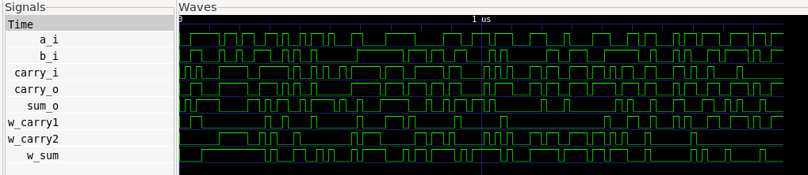

# Tutorial: Verifying a Full-Adder using UVM.

This tutorial is a practical guide focused on verifying a Verilog *full-adder* module. It assumes you have already read the main `README.md` and understand the verification architecture (Driver, Monitor, Scoreboard) we are using.

Our goal here is to detail:
1.  The Verilog module we are testing (DUT).
2.  The specific verification logic for the *full-adder*.
3.  How to run the simulation and interpret the results.

## Prerequisites

To follow this tutorial, you will need:
* A Verilog simulator (e.g., Icarus Verilog).
* Python 3.6+.
* Cocotb (`pip install cocotb`).
* GTKWave (optional, for waveform viewing).

## File Structure

We assume the following file structure for the project:
```bash
/project-full-adder
│
├── full_adder.v        # Design Under Test 
├── uvm_full_adder.py   # UVM testbench 
├── Makefile            
└── dump.fst            # (Generated after simulation) Waveform file
```

## 1. The DUT (Design Under Test): `full_adder.v`

The *full-adder* is a combinational circuit that adds three input bits (`a`, `b`, and `cin`) and produces a sum (`s`) and a carry-out (`cout`). 

Our goal is to prove that our [full-adder](https://github.com/UVMUFSC/IP-Cores/tree/main/ip-cores/full-adder) verilog implementation is correct. 

# 2. The Verification Logic: `uvm_full_adder.py`

Although our testbench has several components (Driver, Monitor), the "intelligence" of the full-adder verification is concentrated in two places:

---

## a) The Reference Model (Scoreboard)

The **Scoreboard** needs to know what the correct result is for any given input.  
We do this by implementing the same Boolean logic as the full-adder, but in **Python**.  
This is our *golden model*.

Look at the `ref_model` function inside the `Scoreboard` class:

```python
# 4. Scoreboard
class Scoreboard:
    # ... (other functions) ...
    def ref_model(self, tr: FullAdderTransaction):
        # This is the 'golden model' logic in Python
        s_expected = tr.a ^ tr.b ^ tr.cin
        c_expected = (tr.a & tr.b) | (tr.cin & (tr.a ^ tr.b))
        
        # Store the expected result for future comparison
        self.expected_queue.append({
            "inputs": (tr.a, tr.b, tr.cin),
            "outputs": (s_expected, c_expected)
        })
```
## b) The Test Sequence (Test)
Since the full-adder has 3 input bits, we can perform an exhaustive verification,
testing 100% of the possible combinations: (0,0,0), (0,0,1), (0,1,0), (0,1,1), (1,0,0), (1,0,1), (1,1,0), and (1,1,1).

This is defined in the full_adder_uvm_test function:

```python
# 6. Test
@cocotb.test()
async def full_adder_random_test(dut):
    env = Environment(dut)

    # 1. We define all possible test vectors
    test_vectors = [(0,0,0), (0,0,1), (1,1,0), (1,1,1)]

    # 2. We iterate through each vector
    for a, b, cin in test_vectors:
        tr = FullAdderTransaction(a=a, b=b, cin=cin)
        
        # 3. Tell the Scoreboard what to expect
        env.scoreboard.ref_model(tr)
        
        # 4. Send the inputs to the DUT
        await env.driver.drive(tr)
        
        # 5. Capture the DUT outputs (and trigger the Scoreboard)
        await env.monitor.run()

    # 6. Check if any errors were found
    assert env.scoreboard.errors == 0
```


The test is simple: it loops through all scenarios, and for each one, it calculates the expected value, drives the DUT, and checks the result.

# 3. Running the Verification

To run the simulation, we need a Makefile that tells Cocotb which files to use.

##  Makefile

```makefile
SIM ?= icarus
TOPLEVEL_LANG ?= verilog

VERILOG_SOURCES += full_adder.v

COCOTB_TEST_MODULES = uvm_full_adder

TOPLEVEL = full_adder

include $(shell cocotb-config --makefiles)/Makefile.sim
```

With this file in the folder, just run in the terminal:
```bash
make SIM=icarus WAVES=1
```

This will compile the Verilog, start the simulator, and run the Python testbench. 
```bash
WAVES=1
```
It will be responsible for generating the waveform files in `.fst` format.

# 4. Analyzing the Results

After running `make`, we analyze two artifacts:

## a) Console Output
The console shows the Scoreboard log in real-time. Each [SCOREBOARD PASS] line tells us that, for a given pair of inputs, the DUT's s and c outputs matched our reference model's outputs.
```console
[SCOREBOARD PASS] Entradas (Logic('0'), Logic('0'), Logic('0')) -> sum=0, carry=0
[SCOREBOARD PASS] Entradas (Logic('0'), Logic('0'), Logic('1')) -> sum=1, carry=0
[SCOREBOARD PASS] Entradas (Logic('1'), Logic('1'), Logic('0')) -> sum=0, carry=1
[SCOREBOARD PASS] Entradas (Logic('1'), Logic('1'), Logic('1')) -> sum=1, carry=1
```
The final message TESTS=1 PASS=1 FAIL=0 confirms that the test completed without errors.

## b) Waveform Analysis (GTKWave)

The `make` command also generated a `dump.fst` file. We can open it in GTKWave for visual analysis:
```bash
gtkwave dump.fst
```


# Waveform Analysis

When loading the `a`, `b`, `cin`, `s`, and `cout` signals, we see the following graph:



---

## Step-by-step Analysis (in sync with our test vectors):

1. **a=0, b=0, cin=0 (Start):**  
   Inputs `a`, `b`, and `cin` are 0.  
   Outputs `s` (sum) and `cout` (carry) are also 0.  
   ✅ **Correct.**

---

2. **a=0, b=0, cin=1:**  
   Signal `cin` goes high to 1.  
   Immediately, output `s` goes high to 1, while `cout` remains 0.  
   (0 + 0 + 1 = 1, carry 0)  
   ✅ **Correct.**

---

3. **a=1, b=1, cin=0:**  
   Signals `a` and `b` go high to 1, `cin` goes low to 0.  
   We see `s` (sum) go low to 0 and `cout` (carry) go high to 1.  
   (1 + 1 + 0 = 0, carry 1)  
   ✅ **Correct.**

---

4. **a=1, b=1, cin=1:**  
   All signals go high to 1.  
   We see `s` (sum) go high to 1 and `cout` (carry) go high to 1.  
   (1 + 1 + 1 = 1, carry 1)  
   ✅ **Correct.**

---

## ✅ Visual Confirmation

The visual analysis confirms that the DUT behaved exactly as a **full-adder** should,  
validating the **PASS** results from our Scoreboard.
