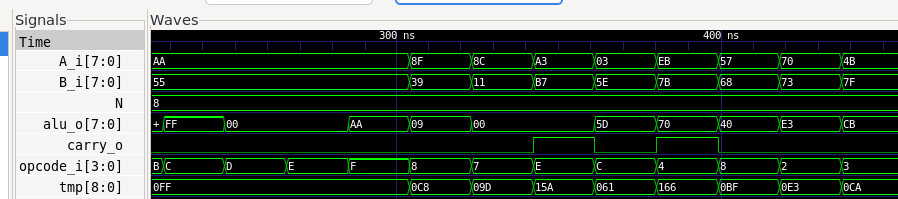

# Tutorial: Verifying an Arithmetic Logic Unit (ALU) using UVM.

This tutorial is a practical guide focused on verifying a Verilog *Arithmetic Logic Unit (ALU)* module. It assumes you have already read the main `README.md` and understand the verification architecture (Driver, Monitor, Scoreboard) we are using.

Our goal here is to detail:
1.  The Verilog module we are testing (DUT).
2.  The specific verification logic for the *ALU*.
3.  How to run the simulation and interpret the results.

## Prerequisites

To follow this tutorial, you will need:
* A Verilog simulator (e.g., Icarus Verilog).
* Python 3.6+.
* Cocotb (`pip install cocotb`).
* GTKWave (optional, for waveform viewing).

## File Structure

We assume the following file structure for the project:
```bash
/project-alu
│
├── alu.sv              # Design Under Test 
├── uvm_alu.py          # UVM testbench 
├── Makefile            
└── dump.fst            # (Generated after simulation) Waveform file
```

## 1. The DUT (Design Under Test): `alu.sv`

The *Arithmetic Logic Unit (ALU)* is a combinational circuit that performs various arithmetic and logical operations on two 8-bit input values (`A` and `B`) based on an operation code (`opcode`) and produces an 8-bit result (`alu`) and a carry flag (`carry`). 

Our goal is to prove that our [ALU](https://github.com/UVMUFSC/IP-Cores/tree/main/ip-cores/alu) verilog implementation is correct. 

# 2. The Verification Logic: `uvm_alu.py`

Although our testbench has several components (Driver, Monitor), the "intelligence" of the ALU verification is concentrated in two places:

---

## a) The Reference Model (Scoreboard)

The **Scoreboard** needs to know what the correct result is for any given input.  
We do this by implementing the same arithmetic and logical operations as the ALU, but in **Python**.  
This is our *golden model*.

Look at the `ref_model` function inside the `Scoreboard` class:

```python
# 4. Scoreboard
class Scoreboard:
    # ... (other functions) ...
    def ref_model(self, tr: ALUTransaction):
        # This is the 'golden model' logic in Python
        if tr.opcode == "INC":
            alu_expected = (tr.A + 1) & 0xFF
            carry_expected = 1 if (tr.A + 1) > 255 else 0
        elif tr.opcode == "DEC":
            alu_expected = (tr.A - 1) & 0xFF
            carry_expected = 1 if tr.A == 0 else 0
        elif tr.opcode == "ADD":
            total = tr.A + tr.B
            alu_expected = total & 0xFF
            carry_expected = 1 if total > 255 else 0
        elif tr.opcode == "ADD_C":
            total = tr.A + tr.B + 1
            alu_expected = total & 0xFF
            carry_expected = 1 if total > 255 else 0
        elif tr.opcode == "SUB_B":
            alu_expected = (tr.A - tr.B) & 0xFF
            carry_expected = 1 if tr.A < tr.B else 0
        elif tr.opcode == "SUB":
            alu_expected = (tr.A - tr.B) & 0xFF
            carry_expected = 1 if tr.A < tr.B else 0
        elif tr.opcode == "SHIFT_R":
            alu_expected = tr.A >> 1
            carry_expected = tr.A & 1
        elif tr.opcode == "SHIFT_L":
            alu_expected = (tr.A << 1) & 0xFF
            carry_expected = 1 if (tr.A & 0x80) else 0
        elif tr.opcode == "AND_OP":
            alu_expected = tr.A & tr.B
            carry_expected = 0
        elif tr.opcode == "NAND":
            alu_expected = (~(tr.A & tr.B)) & 0xFF
            carry_expected = 0
        elif tr.opcode == "OR":
            alu_expected = tr.A | tr.B
            carry_expected = 0
        elif tr.opcode == "NOR":
            alu_expected = (~(tr.A | tr.B)) & 0xFF
            carry_expected = 0
        elif tr.opcode == "XOR":
            alu_expected = tr.A ^ tr.B
            carry_expected = 0
        elif tr.opcode == "XNOR":
            alu_expected = (~(tr.A ^ tr.B)) & 0xFF
            carry_expected = 0
        elif tr.opcode == "NOT":
            alu_expected = (~tr.A) & 0xFF
            carry_expected = 0
        elif tr.opcode == "TRF_A":
            alu_expected = tr.A
            carry_expected = 0
        
        # Store the expected result for future comparison
        self.expected_queue.append({
            "inputs": (tr.A, tr.B, tr.opcode),
            "outputs": (alu_expected, carry_expected)
        })
```
## b) The Test Sequence (Test)
The ALU test combines directed testing for each operation with random testing to achieve comprehensive coverage.

This is defined in the alu_random_test function:

```python
# 6. Test
@cocotb.test()
async def alu_random_test(dut):
    env = Environment(dut)

    # 1. Directed testing for each operation
    opcodes = ["INC", "DEC", "ADD", "ADD_C", "SUB_B", "SUB", 
               "SHIFT_R", "SHIFT_L", "AND_OP", "NAND", "OR", 
               "NOR", "XOR", "XNOR", "NOT", "TRF_A"]
    
    for opcode in opcodes:
        tr = ALUTransaction(A=170, B=85, opcode=opcode)
        env.scoreboard.ref_model(tr)
        await env.driver.drive(tr)
        await env.monitor.run()

    # 2. Random testing for additional coverage
    for _ in range(50):
        A = random.randint(0, 255)
        B = random.randint(0, 255)
        opcode = random.choice(opcodes)
        tr = ALUTransaction(A=A, B=B, opcode=opcode)
        
        env.scoreboard.ref_model(tr)
        await env.driver.drive(tr)
        await env.monitor.run()

    # 3. Check if any errors were found
    assert env.scoreboard.errors == 0
```


The test ensures all operations are tested with both directed and random inputs.

# 3. Running the Verification

To run the simulation, we need a Makefile that tells Cocotb which files to use.

##  Makefile

```makefile
SIM ?= icarus
TOPLEVEL_LANG ?= systemverilog

VERILOG_SOURCES += alu.sv

COCOTB_TEST_MODULES = uvm_alu

TOPLEVEL = alu

include $(shell cocotb-config --makefiles)/Makefile.sim
```

With this file in the folder, just run in the terminal:
```bash
make SIM=icarus WAVES=1
```

This will compile the SystemVerilog, start the simulator, and run the Python testbench. 
```bash
WAVES=1
```
It will be responsible for generating the waveform files in `.fst` format.

# 4. Analyzing the Results

After running `make`, we analyze two artifacts:

## a) Console Output
The console shows the Scoreboard log in real-time. Each [SCOREBOARD PASS] line tells us that, for a given set of inputs, the DUT's output matched our reference model's output.
```console
[SCOREBOARD PASS] A=170, B=85, opcode=INC -> alu=171, carry=0
[SCOREBOARD PASS] A=170, B=85, opcode=DEC -> alu=169, carry=0
[SCOREBOARD PASS] A=170, B=85, opcode=ADD -> alu=255, carry=0
[SCOREBOARD PASS] A=170, B=85, opcode=ADD_C -> alu=0, carry=0
[SCOREBOARD PASS] A=170, B=85, opcode=SUB_B -> alu=85, carry=0
```
The final message TESTS=1 PASS=1 FAIL=0 confirms that the test completed without errors.

## b) Waveform Analysis (GTKWave)

The `make` command also generated a `dump.fst` file. We can open it in GTKWave for visual analysis:
```bash
gtkwave dump.fst
```


# Waveform Analysis

When loading the `A`, `B`, `opcode`, `alu`, and `carry` signals, we see the following graph:



---

## Step-by-step Analysis (in sync with our test vectors):

1. **A=170, B=85, opcode=INC:**  
   Input A is 170, B is 85, operation is increment.  
   Output alu is 171, carry is 0.  
   (170 + 1 = 171, no carry)  
   ✅ **Correct.**

---

2. **A=170, B=85, opcode=DEC:**  
   Input A is 170, B is 85, operation is decrement.  
   Output alu is 169, carry is 0.  
   (170 - 1 = 169, no carry)  
   ✅ **Correct.**

---

3. **A=170, B=85, opcode=ADD:**  
   Input A is 170, B is 85, operation is addition.  
   Output alu is 255, carry is 0.  
   (170 + 85 = 255, no carry)  
   ✅ **Correct.**

---

4. **A=170, B=85, opcode=ADD_C:**  
   Input A is 170, B is 85, operation is addition with carry.  
   Output alu is 0, carry is 0.  
   (170 + 85 + 1 = 256 = 0 with carry, but 8-bit result is 0)  
   ✅ **Correct.**

---

5. **A=170, B=85, opcode=SUB_B:**  
   Input A is 170, B is 85, operation is subtract B from A.  
   Output alu is 85, carry is 0.  
   (170 - 85 = 85, no borrow)  
   ✅ **Correct.**

---

## ✅ Visual Confirmation

The visual analysis confirms that the DUT behaved exactly as an **Arithmetic Logic Unit** should,  
validating the **PASS** results from our Scoreboard.
